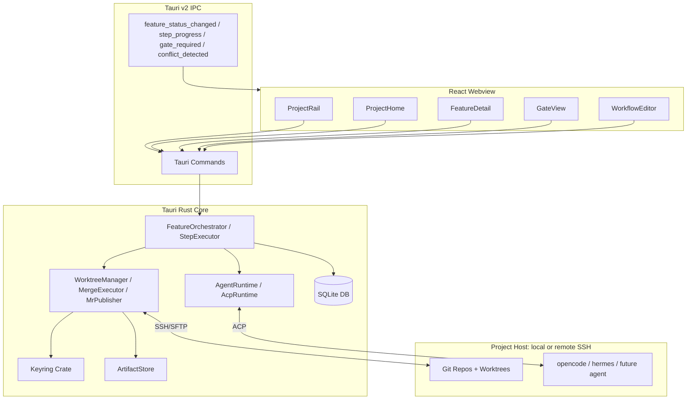

# Demeteo: Project Constitution & Reference Index

This document serves as the master constitution and architectural index for **Demeteo**. It governs codebase styling, visual design guidelines, and maps the complete documentation index for developers and AI agents.

---

## 1. Project Identity & Philosophy

### Name Origin
* **Demeteo** plays with the Spanish language (*monitoreo*, *demeteo*) and classical Greek mythology:
  * **Deméter** (Demeter): The goddess of agriculture and growth, representing the cultivation of data pipelines, server connections, and agent orchestration.
  * **Prometeo** (Prometheus): The Titan of foresight who brought fire (technology) to humanity, representing developer empowerment.

### Core Vision
Demeteo is a modern, premium desktop control center for orchestrating local and remote AI agents. It bridges the gap between raw SSH terminal access and structured web-API control panels, providing a seamless visual workspace to monitor processes, chat with remote LLMs/agents, and edit remote codebases in real-time.

### 🚧 Current Pivot: Multi-Agent Orchestrator (June 2026)

> **The chat-style "supervisor for one agent" framing is legacy.** As of
> the redesign interview (33 locked decisions), demeteo is being pivoted
> to a **fleet-style multi-agent orchestrator**. The chat UX is removed;
> the user describes a feature, demeteo decomposes it through a
> reusable Workflow, delegates work to coding agents, and keeps the
> user in the loop at explicit Gates.
>
> **Source of truth:** [`REDESIGN_PLAN.md`](REDESIGN_PLAN.md) (master) and
> [`docs/REDESIGN_DECISIONS.md`](docs/REDESIGN_DECISIONS.md) (the 33
> decisions, rendered as a reference appendix). The plan is executed
> across phases R0–R8 (see §5 below). The legacy single-agent work is
> preserved in [`docs/LEGACY_*.md`](docs/) for historical context.
>
> **Key vocabulary:** Project, Feature, Workflow, Step (`agent` /
> `parallel` / `gate`), Subtask, Gate, ProviderInstance. See
> [`docs/REDESIGN_DDD_MODEL.md`](docs/REDESIGN_DDD_MODEL.md) for the
> full ubiquitous language.

---

## 🎨 2. Visual Design Rules (Dark Neon Glassmorphism)

All frontend components and styling changes must strictly adhere to the following rules:

1. **Background**: Obsidian and deep carbon gradients (`#08090c` and `#0d0f14`), layered with a subtle radial gradient of violet and cyan to give depth.
2. **Backdrop Blurs**: Translucent cards (`rgba(18, 22, 30, 0.75)`) utilizing CSS `backdrop-filter: blur(12px)` and thin border glows (`rgba(255,255,255,0.05)`).
3. **Glowing Status Accents**: 
   * **Violet (`#8b5cf6`)**: Active connection tunnels and core operations.
   * **Cyan (`#06b6d4`)**: Real-time terminal data streaming and interactive sessions.
   * **Emerald (`#10b981`)**: Running agent processes and healthy statuses.
   * **Ruby (`#ef4444`)**: Inactive servers, stopped tasks, or connection failures.
4. **Typography**: Headings use **Outfit** (sharp, geometric); UI elements use **Inter** (clean, readable sans-serif); Terminals/editors use **Fira Code** or **JetBrains Mono** (monospaced with ligatures).
5. **Motion**: Subtle pulsing glows for status dots, and smooth transitions when switching workspaces.

---

## 📐 3. Architecture & Technical Map

Demeteo leverages a lightweight Rust-backend and web-frontend architecture. The post-pivot shape is a multi-agent orchestrator; the diagram below reflects the active plan.

For the full hexagon, port catalogue, and file layout see
[`docs/REDESIGN_ARCHITECTURE.md`](docs/REDESIGN_ARCHITECTURE.md). For the
domain entities and bounded contexts see
[`docs/REDESIGN_DDD_MODEL.md`](docs/REDESIGN_DDD_MODEL.md).

---

## 🗂️ 4. Documentation & Schema Index

Demeteo utilizes progressive disclosure to separate high-level concepts from concrete implementations. The active plan lives under the redesign branch; legacy docs are preserved for historical context.

### Active plan (multi-agent orchestrator)

* **[Master Plan (REDESIGN_PLAN.md)](REDESIGN_PLAN.md)**: pivot summary, 33-decision table, bounded contexts, phase plan, list of deferred questions.
* **[Domain Model & Bounded Contexts (docs/REDESIGN_DDD_MODEL.md)](docs/REDESIGN_DDD_MODEL.md)**: ubiquitous language, 7 bounded contexts with aggregates, value objects, ports, and invariants.
* **[Ports & Adapters Blueprint (docs/REDESIGN_ARCHITECTURE.md)](docs/REDESIGN_ARCHITECTURE.md)**: hexagon, full port catalogue, directory layout, Tauri command surface, frontend state model, migration strategy.
* **[Execution & Verification Plan (docs/REDESIGN_EXECUTION_PLAN.md)](docs/REDESIGN_EXECUTION_PLAN.md)**: phase-by-phase tasks, done-means statements, verification commands, Gantt timeline.
* **[Locked Decisions Reference (docs/REDESIGN_DECISIONS.md)](docs/REDESIGN_DECISIONS.md)**: the 33-decision table as a standalone reference, cross-linked to all other docs.
* **[Open & Deferred Questions (docs/REDESIGN_OPEN_QUESTIONS.md)](docs/REDESIGN_OPEN_QUESTIONS.md)**: deferred items with phase placement key and rationale, so they don't get lost.
* **[Agent Integration Spec (AGENT_INTEGRATION.md)](AGENT_INTEGRATION.md)**: the rewritten (post-pivot) `AcpRuntime` spec — source of truth for the agent runtime that drives both planner and subtask sessions.

### Carried-forward references

* **[SQLite Database Schema Specification (DATABASE_SCHEMA.md)](DATABASE_SCHEMA.md)**: SQLite tables configuration (carried forward; will be superseded by the new schema in Phase R1).
* **[SSH & Connection Flow Protocols (CONNECTION_FLOWS.md)](CONNECTION_FLOWS.md)**: low-level terminal channels, port forwarding, keyring, and SFTP synchronization flows.

### Legacy single-agent work (preserved for historical context)

* [`docs/LEGACY_DDD_MODEL.md`](docs/LEGACY_DDD_MODEL.md) — was `DDD_MODEL.md`.
* [`docs/LEGACY_ARCHITECTURE.md`](docs/LEGACY_ARCHITECTURE.md) — was `ARCHITECTURE.md`.
* [`docs/LEGACY_EXECUTION_PLAN.md`](docs/LEGACY_EXECUTION_PLAN.md) — was `EXECUTION_PLAN.md`.

These describe the chat-style supervisor for one coding agent. They are not the active plan; the `AcpRuntime` spec inside is the only portion that survived the pivot (now in `AGENT_INTEGRATION.md`).

---

## 🎯 5. Implementation Phases

### Active plan: R0–R8 (multi-agent orchestrator)

Detailed tasks, done-means, and verification per phase:
[`docs/REDESIGN_EXECUTION_PLAN.md`](docs/REDESIGN_EXECUTION_PLAN.md).

1. **Phase R0: Domain & docs** *(in progress on this branch)*
   * The six `REDESIGN_*.md` docs exist; legacy docs archived.
2. **Phase R1: Greenfield schema & ports** *(next)*
   * New SQLite tables, new ports, no UI changes, no agent spawns.
3. **Phase R2: Project bootstrap & provider wiring**
   * Project create, clone repos via PAT, bootstrap detection, worktree strategy proposal.
4. **Phase R3: Workflow catalog & authoring**
   * Workflow CRUD + versioning + import/export, starter pack bundled.
5. **Phase R4: Step executor**
   * The small DAG engine; `agent` / `parallel` / `gate` step types; conditional edges.
6. **Phase R5: Feature orchestrator + UI**
   * "Start feature" modal, ProjectHome, FeatureDetail, telemetry, re-entry.
7. **Phase R6: Worktree & merge**
   * Per-feature `feature/<slug>` branch, per-subtask worktrees, sequential merge, conflict resolution cascade, optional MR.
8. **Phase R7: UX polish & docs**
   * Project rail, settings, first-run UX, sample project, docs panel, command palette, keyboard shortcuts.
9. **Phase R8: Hardening & migration**
   * Additive migrations (silent), breaking migrations (wipe-and-reinit), pre-migration backups, migration log.

### Legacy single-agent work (Phases 1–6, completed before the pivot)

> These phases shipped a chat-style supervisor for one coding agent.
> The work is preserved in git history and the `docs/LEGACY_*.md`
> archives. It is **not** the active plan.

1. **Phase 1: Foundation & Project Setup** *(Completed, legacy)*
   * App scaffolding, configuration directories, styling design system.
2. **Phase 2: Database & Keyring Setup** *(Completed, legacy)*
   * SQLite tables creation, Rust bindings for machines and agent profiles database commands.
3. **Phase 3: SSH Connections & Terminal I/O** *(Completed, legacy)*
   * Rust PTY controller, Tauri channel streaming, live terminal display.
4. **Phase 4: SSH Port Forwarding & Agent API Interface** *(Completed, legacy)*
   * Port forwarding listeners, Ollama/CLI modular adapters, agent chat screen.
5. **Phase 5: SFTP File Explorer & Monaco Editor** *(Completed, legacy)*
   * SFTP read/write commands, tree sidebar, Monaco editor tab.
6. **Phase 6: UX Polish, Animations & Dark Neon Themes** *(Completed, legacy)*
   * Custom indicators, active connection animations, robust error-handling.

## graphify

This project has a knowledge graph at graphify-out/ with god nodes, community structure, and cross-file relationships.

When the user types `/graphify`, invoke the `skill` tool with `skill: "graphify"` before doing anything else.

Rules:
- For codebase questions, first run `graphify query "<question>"` when graphify-out/graph.json exists. Use `graphify path "<A>" "<B>"` for relationships and `graphify explain "<concept>"` for focused concepts. These return a scoped subgraph, usually much smaller than GRAPH_REPORT.md or raw grep output.
- Dirty graphify-out/ files are expected after hooks or incremental updates; dirty graph files are not a reason to skip graphify. Only skip graphify if the task is about stale or incorrect graph output, or the user explicitly says not to use it.
- If graphify-out/wiki/index.md exists, use it for broad navigation instead of raw source browsing.
- Read graphify-out/GRAPH_REPORT.md only for broad architecture review or when query/path/explain do not surface enough context.
- After modifying code, run `graphify update .` to keep the graph current (AST-only, no API cost).
