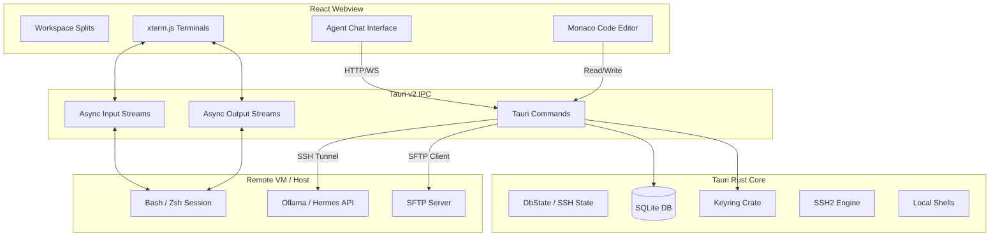

# Demeteo: Project Constitution & Reference Index

This document serves as the master constitution and architectural index for **Demeteo**. It governs codebase styling, visual design guidelines, and maps the complete documentation index for developers and AI agents.

---

## 1. Project Identity & Philosophy

### Name Origin
* **Demeteo** plays with the Spanish language (*monitoreo*, *demeteo*) and classical Greek mythology:
  * **Deméter** (Demeter): The goddess of agriculture and growth, representing the cultivation of data pipelines, server connections, and agent orchestration.
  * **Prometeo** (Prometheus): The Titan of foresight who brought fire (technology) to humanity, representing developer empowerment.

### Core Vision
Demeteo is a modern, premium desktop control center for orchestrating local and remote AI agents. It bridges the gap between raw SSH terminal access and structured web-API control panels, providing a seamless visual workspace to monitor processes, chat with remote LLMs/agents, and edit remote codebases in real-time.

---

## 🎨 2. Visual Design Rules (Dark Neon Glassmorphism)

All frontend components and styling changes must strictly adhere to the following rules:

1. **Background**: Obsidian and deep carbon gradients (`#08090c` and `#0d0f14`), layered with a subtle radial gradient of violet and cyan to give depth.
2. **Backdrop Blurs**: Translucent cards (`rgba(18, 22, 30, 0.75)`) utilizing CSS `backdrop-filter: blur(12px)` and thin border glows (`rgba(255,255,255,0.05)`).
3. **Glowing Status Accents**: 
   * **Violet (`#8b5cf6`)**: Active connection tunnels and core operations.
   * **Cyan (`#06b6d4`)**: Real-time terminal data streaming and interactive sessions.
   * **Emerald (`#10b981`)**: Running agent processes and healthy statuses.
   * **Ruby (`#ef4444`)**: Inactive servers, stopped tasks, or connection failures.
4. **Typography**: Headings use **Outfit** (sharp, geometric); UI elements use **Inter** (clean, readable sans-serif); Terminals/editors use **Fira Code** or **JetBrains Mono** (monospaced with ligatures).
5. **Motion**: Subtle pulsing glows for status dots, and smooth transitions when switching workspaces.

---

## 📐 3. Architecture & Technical Map

Demeteo leverages a lightweight Rust-backend and web-frontend architecture:

---

## 🗂️ 4. Documentation & Schema Index

Demeteo utilizes progressive disclosure to separate high-level concepts from concrete implementations. Refer to the specific sub-documents below for details:

* **[Domain Model & Bounded Contexts (DDD_MODEL.md)](file:///home/jsteven/Projects/demeteo/DDD_MODEL.md)**: Ubiquitous Language, entities, and bounded context definitions.
* **[Ports & Adapters Blueprint (ARCHITECTURE.md)](file:///home/jsteven/Projects/demeteo/ARCHITECTURE.md)**: Code layout directory structure, port interfaces, and WASM plugin extension traits.
* **[SQLite Database Schema Specification (DATABASE_SCHEMA.md)](file:///home/jsteven/Projects/demeteo/DATABASE_SCHEMA.md)**: SQLite tables configuration for machines, profiles, messages, and session histories.
* **[SSH & Connection Flow Protocols (CONNECTION_FLOWS.md)](file:///home/jsteven/Projects/demeteo/CONNECTION_FLOWS.md)**: Low-level terminal channels, port forwarding, keyring, and SFTP synchronization flows.
* **[Execution & Verification Plan (EXECUTION_PLAN.md)](file:///home/jsteven/Projects/demeteo/EXECUTION_PLAN.md)**: Core implementation tasks list, verification checkpoints, and Gantt roadmap timeline.

---

## 🎯 5. Implementation Phases

1. **Phase 1: Foundation & Project Setup** *(Completed)*
   * App scaffolding, configuration directories, styling design system.
2. **Phase 2: Database & Keyring Setup** *(Completed)*
   * SQLite tables creation, Rust bindings for machines and agent profiles database commands.
3. **Phase 3: SSH Connections & Terminal I/O** *(Completed)*
   * Rust PTY controller, Tauri channel streaming, live terminal display.
4. **Phase 4: SSH Port Forwarding & Agent API Interface** *(Completed)*
   * Port forwarding listeners, Ollama/CLI modular adapters, agent chat screen.
5. **Phase 5: SFTP File Explorer & Monaco Editor** *(Completed)*
   * SFTP read/write commands, tree sidebar, Monaco editor tab.
6. **Phase 6: UX Polish, Animations & Dark Neon Themes** *(Completed)*
   * Custom indicators, active connection animations, robust error-handling.

## graphify

This project has a knowledge graph at graphify-out/ with god nodes, community structure, and cross-file relationships.

When the user types `/graphify`, invoke the `skill` tool with `skill: "graphify"` before doing anything else.

Rules:
- For codebase questions, first run `graphify query "<question>"` when graphify-out/graph.json exists. Use `graphify path "<A>" "<B>"` for relationships and `graphify explain "<concept>"` for focused concepts. These return a scoped subgraph, usually much smaller than GRAPH_REPORT.md or raw grep output.
- Dirty graphify-out/ files are expected after hooks or incremental updates; dirty graph files are not a reason to skip graphify. Only skip graphify if the task is about stale or incorrect graph output, or the user explicitly says not to use it.
- If graphify-out/wiki/index.md exists, use it for broad navigation instead of raw source browsing.
- Read graphify-out/GRAPH_REPORT.md only for broad architecture review or when query/path/explain do not surface enough context.
- After modifying code, run `graphify update .` to keep the graph current (AST-only, no API cost).
