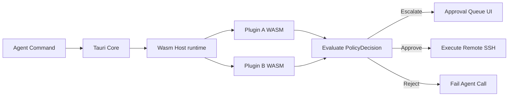

# Architectural Blueprint: Hexagonal (Ports & Adapters) Structure

This document details the software architecture of **Demeteo** using the **Hexagonal Architecture (Ports & Adapters)** pattern. This design guarantees loose coupling, high testability, and a clear path for future plugin extensibility.

---

## 📐 The Hexagon: Ports & Adapters Design

Demeteo's core responsibilities are decoupled from external frameworks (Tauri, SQLite, SSH networking libraries). The application is structured into the **Core Domain**, **Ports (interfaces)**, and **Adapters (implementations)**.

```
                  +-------------------------------------------------------+
                  |                     ADAPTERS (Driven)                 |
                  |                                                       |
                  |   +-----------------------------------------------+   |
                  |   |                SQLite DB Adapter              |   |
                  |   +-----------------------+-----------------------+   |
                  |                           |                           |
                  +---------------------------|---------------------------+
                                              | (implements)
                                              v
+-----------------+       +-----------------------------------------------+       +------------------+
| ADAPTERS (Driver|       |                 PORTS (Driven)                |       | ADAPTERS (Driven)|
|                 |       |                                               |       |                  |
| +-------------+ |       |  +-----------------------------------------+  |       |  +-------------+ |
| |  Tauri IPC  | |=====> |  |              DatabasePort               |  |       |  |  SshRussh   | |
| +-------------+ |(calls)|  +-----------------------------------------+  |       |  |  SFTP       | |
|                 |       |                                               |       |  +------+------+ |
| +-------------+ |       |  +-----------------------------------------+  |       |         ^        |
| | McpServer   | |=====> |  |             ExecutionPort               |  |====== font color="green">| (implements)
| +-------------+ |       |  +-----------------------------------------+  |       |                  |
|                 |       |                                               |       |  +-------------+ |
| +-------------+ |       |  +-----------------------------------------+  |       |  | Local Shell | |
| | WebSocket   | |       |  |           NotificationPort              |  |       |  +-------------+ |
| +-------------+ |       |  +-----------------------------------------+  |       +------------------+
+-----------------+       +-----------------------^-----------------------+
                                                  |
                                                  | (notifies)
                                                  |
                  +-------------------------------|-----------------------+
                  |                  CORE DOMAIN (Hexagon)                |
                  |                                                       |
                  |   +-----------------------------------------------+   |
                  |   |  - Policy Engine (Approval Rules)             |   |
                  |   |  - Thread Coordinator (Worktree isolation)   |   |
                  |   |  - Session State Machine (SSH channels)       |   |
                  |   +-----------------------------------------------+   |
                  |                                                       |
                  +-------------------------------------------------------+
```

---

## 📁 Recommended Directory Structure

To align the codebase with this architecture, we will partition the Rust project under `src-tauri/src` as follows:

```text
src-tauri/src/
├── main.rs                 # CLI entry point
├── lib.rs                  # Tauri entry point & DI wire-up
├── domain/                 # Core Domain (No dependencies on tauri or russh)
│   ├── mod.rs
│   ├── models.rs           # Machine, Session, CommandEvent, PolicyRule
│   ├── policy.rs           # Core validation engine & auto-approve rules
│   └── coordinator.rs      # Session coordinator & state machines
├── ports/                  # Inbound and Outbound Interfaces (Traits)
│   ├── mod.rs
│   ├── db.rs               # DatabasePort (Persistence of connections & rules)
│   ├── execution.rs        # ExecutionPort (Terminal control, SFTP, Worktrees)
│   └── notification.rs     # NotificationPort (Pushing UI approvals & logs)
├── adapters/               # Implementations of Ports
│   ├── mod.rs
│   ├── database/           # SQLite implementation (rusqlite/sqlx)
│   │   ├── mod.rs
│   │   └── sqlite.rs
│   ├── ssh/                # SSH/SFTP network implementation (russh)
│   │   ├── mod.rs
│   │   └── client.rs
│   ├── local/              # Local environment shell controller
│   │   ├── mod.rs
│   │   └── pty.rs
│   └── tauri_ui/           # Tauri command mapping (Driver) & event system
│       ├── mod.rs
│       ├── commands.rs
│       └── events.rs
└── plugins/                # Extension Engine
    ├── mod.rs
    ├── trait.rs            # Plugin trait definitions
    └── wasm_host.rs        # Wasmer/Wasmtime policy evaluator
```

---

## 🔌 Extensibility & Plugin Host Architecture

To enable third-party plugins (e.g. customized approval strategies, telemetry integrations, new LLM/Agent protocols), Demeteo implements a WebAssembly (WASM) compiler runtime interface. 

### 1. The Plugin Interface (Rust Trait)

All plugins compile to WASM targets and implement a normalized set of functions:

```rust
// src-tauri/src/plugins/trait.rs

pub struct PluginContext {
    pub machine_id: String,
    pub work_directory: String,
}

pub enum PolicyDecision {
    Approve,
    Reject { reason: String },
    EscalateToUser,
}

pub trait DemeteoPlugin {
    /// Unique identifier for the plugin
    fn name(&self) -> &str;

    /// Evaluates if a given tool-call or shell command needs human validation
    fn evaluate_command(
        &self, 
        ctx: &PluginContext, 
        command: &str
    ) -> PolicyDecision;

    /// Intercepts SFTP write payloads (can inspect/modify code updates before write)
    fn intercept_file_write(
        &self, 
        ctx: &PluginContext, 
        file_path: &str, 
        content: &[u8]
    ) -> PolicyDecision;
}
```

### 2. WASM Sandbox Engine (`wasmtime` integration)

WASM plugins execute in a sandbox with restricted resources. They cannot access the local filesystem or make unauthorized HTTP requests directly, guaranteeing that the Supervisor dashboard remains secure.



---

## 🔗 Port Specifications (Traits)

### 1. Database Port (`ports/db.rs`)
Defines how configuration states, credentials, active sessions, and logs are persisted.

```rust
pub trait DatabasePort: Send + Sync {
    fn fetch_machines(&self) -> Result<Vec<Machine>, Error>;
    fn save_machine(&self, machine: &Machine) -> Result<(), Error>;
    fn fetch_auto_approval_rules(&self, machine_id: &str) -> Result<Vec<String>, Error>;
    fn update_auto_approval_rules(&self, machine_id: &str, rules: &[String]) -> Result<(), Error>;
    fn save_thread_session(&self, session: &ThreadSession) -> Result<(), Error>;
}
```

### 2. Remote Execution Port (`ports/execution.rs`)
Defines network boundaries. Concrete implementations (SSH vs Local) are injected dynamically based on target configuration.

```rust
#[async_trait::async_trait]
pub trait ExecutionPort: Send + Sync {
    /// Launches a command or shell session
    async fn run_command(&self, cmd: &str) -> Result<CommandResult, Error>;

    /// Reads remote files via SFTP/Local FS
    async fn read_file(&self, path: &str) -> Result<Vec<u8>, Error>;

    /// Writes content to the filesystem safely
    async fn write_file(&self, path: &str, data: &[u8]) -> Result<(), Error>;

    /// Sets up the Git Worktree branch directory
    async fn setup_worktree(&self, repo_path: &str, branch: &str, sandbox_path: &str) -> Result<(), Error>;
}
```

---

## 🔀 Step-by-Step Implementation Sequence

1. **Decouple Core Logic**: Move structural SQLite code from [db.rs](file:///home/jsteven/Projects/demeteo/src-tauri/src/db.rs) and SFTP logic from [sftp.rs](file:///home/jsteven/Projects/demeteo/src-tauri/src/sftp.rs) behind traits inside `src-tauri/src/ports/`.
2. **Implement Adapters**:
   * Wrap the SQLite connection in a struct implementing `DatabasePort`.
   * Create an adapter wrapping SSH/SFTP (`russh` implementation) inside `adapters/ssh/client.rs` implementing `ExecutionPort`.
3. **Register dependency injections** in the Tauri application setup block in [lib.rs](file:///home/jsteven/Projects/demeteo/src-tauri/src/lib.rs), storing adapters inside Tauri state pools.
4. **WASM Plugin Host Setup**: Pull in the `wasmtime` dependency in `Cargo.toml` to load and compile WASM plugins dynamically from a local configuration directory (e.g. `~/.config/demeteo/plugins/`).
