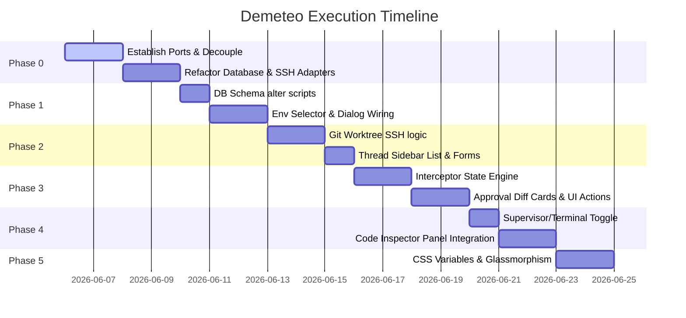

# Demeteo: Execution & Verification Plan

This document defines the step-by-step roadmap for executing and verifying the implementation tasks detailed in [prd_task_breakdown.md](file:///home/jsteven/.gemini/antigravity-cli/brain/48a0e814-f589-4e35-b927-858d5d662c95/prd_task_breakdown.md). It outlines verification checklists, testing commands, and success criteria for each development phase.

---

## 🚀 Execution Roadmap & Checklists

### 📐 Phase 0: Architecture Alignment & Core Refactoring
*Goal: Reorganize backend modules to follow [ARCHITECTURE.md](file:///home/jsteven/Projects/demeteo/ARCHITECTURE.md) Ports & Adapters.*

- [ ] **Step 0.1: Port Traits Definition**
  * Create folder structure: `src-tauri/src/ports/` and `src-tauri/src/domain/`.
  * Move core domain models from [db.rs](file:///home/jsteven/Projects/demeteo/src-tauri/src/db.rs) (e.g. `Machine`, `AgentProfile`) to `src-tauri/src/domain/models.rs`.
  * Define `DatabasePort` and `ExecutionPort` traits.
- [ ] **Step 0.2: SQLite Adapter Migration**
  * Create `src-tauri/src/adapters/database/sqlite.rs`.
  * Implement `DatabasePort` using raw SQL commands from `db.rs`.
- [ ] **Step 0.3: SSH/SFTP Adapter Migration**
  * Create `src-tauri/src/adapters/ssh/client.rs`.
  * Extract terminal and PTY command streams from [terminal.rs](file:///home/jsteven/Projects/demeteo/src-tauri/src/terminal.rs) and SFTP synchronizations from [sftp.rs](file:///home/jsteven/Projects/demeteo/src-tauri/src/sftp.rs) into `adapters/ssh/client.rs` implementing `ExecutionPort`.
- [ ] **Step 0.4: Tauri Dependency Injection Wiring**
  * Update [lib.rs](file:///home/jsteven/Projects/demeteo/src-tauri/src/lib.rs) setup pool to initialize the SQLite and SSH adapters, injecting them into Tauri state.
  * Update Tauri command registrations to forward payloads to state-injected Ports.

> **Verification Checkpoint (Phase 0)**
> * Run compilation: `cargo check --manifest-path src-tauri/Cargo.toml`.
> * Validate that existing connection flows run correctly using the original terminal shell view.

---

### 🛠️ Phase 1: Database & Target Environment Management
*Goal: Add agent arrays and customizable auto-approval rules to database connections and hook them to the frontend modal.*

- [ ] **Step 1.1: Column Additions**
  * Update initialization SQL scripts inside database adapter to execute schema migrations on start:
    ```sql
    ALTER TABLE machines ADD COLUMN agents TEXT;
    ALTER TABLE machines ADD COLUMN auto_approved_rules TEXT;
    ```
- [ ] **Step 1.2: Model & UI Dialog Wiring**
  * Integrate backend updates to fetch and save `agents` (JSON-encoded array) and `auto_approved_rules`.
  * Connect the environment form in [AppMockup.tsx](file:///home/jsteven/Projects/demeteo/src/AppMockup.tsx#L509-L619) to Tauri DB handlers, updating state dropdown selectors.

> **Verification Checkpoint (Phase 1)**
> * Execute database inspection using sqlite3:
>   `sqlite3 ~/.local/share/com.demeteo.app/demeteo.db "PRAGMA table_info(machines);"`
> * Verify that fields `agents` and `auto_approved_rules` exist in the table info.
> * Save a dummy server connection with rules `["^git status$", "^cat .*"]` and verify it persists when refreshing the app.

---

### 🧵 Phase 2: Active Threads & Sandbox Isolation
*Goal: Implement automated Git-worktree branch provisioning on target machines and map active sessions in the dashboard.*

- [ ] **Step 2.1: Rust Git-Worktree Module**
  * Create `src-tauri/src/adapters/ssh/worktree.rs` as an extension to `ExecutionPort`.
  * Write remote directory setup operations to build the hidden `.demeteo/worktrees/` directory and configure `.git/info/exclude`.
  * Write remote execution scripts to run `git worktree add -b <branch_name> <path> origin/main`.
- [ ] **Step 2.2: Thread Workspace Sync**
  * Connect the frontend thread creation form (Project vs Ad-Hoc mode) to the backend database scheduler.
  * Render active threads with their execution status in the sidebar.

> **Verification Checkpoint (Phase 2)**
> * Create a Project-mode thread named "feature-oauth".
> * Log into target remote environment via SSH:
>   Verify that `.demeteo/worktrees/feature-oauth/` is created and isolated.
> * Execute `git status` on the target main repo. Verify that `.demeteo/` does not show up as untracked.

---

### 🛡️ Phase 3: Permission Proxy & Approval Queue
*Goal: Implement intercept handlers to block mutating commands and display visual diff blocks.*

- [ ] **Step 3.1: Interceptor Engine**
  * Implement command analysis inside target connection runners.
  * When execution command does not match DB-loaded `auto_approved_rules`, suspend PTY execution stream.
- [ ] **Step 3.2: Approval Panel & Frontend Handler**
  * Emit `permission_requested` event to the frontend.
  * Render approval cards containing file paths and green diff additions.
  * Wire "Approve" / "Reject" clicks to release the blocked thread or return feedback.

> **Verification Checkpoint (Phase 3)**
> * Issue command `cargo build` through agent interface.
> * Validate that thread status updates to `pending_approval` (pulsing orange) and the approval card renders in the stream.
> * Click "Reject" with feedback: verify the command execution is cancelled and feedback returns in stdout.

---

### 🔍 Phase 4: Contextual Split-Pane & Workspace Toggles
*Goal: Build the tab workspace toggler and Monaco split-pane inspector panel.*

- [ ] **Step 4.1: Tabs Workspace Toggle**
  * Condition rendering based on `workspaceMode` state variable ('supervisor' vs 'terminal').
- [ ] **Step 4.2: Monaco Code Inspector**
  * Implement slide-in transition animations.
  * Feed file content retrieved via SFTP `read_file` port to the Monaco instance configured with `readOnly: true`.

> **Verification Checkpoint (Phase 4)**
> * In the approval card, click "Inspect Context".
> * Verify that the code inspector slides out, the stream pane shifts to fit, and Monaco loads the file highlighting target code changes.

---

### 🎨 Phase 5: High-Tech Glassmorphism Styling
*Goal: Polish animations, scrollbars, and apply Obsidian visual colors.*

- [ ] **Step 5.1: Integrate Obsidian Colors & Glass Styling**
  * Remove residual mockup styles and apply variables configured in [App.css](file:///home/jsteven/Projects/demeteo/src/App.css) (gradients, glows, layout paddings).
- [ ] **Step 5.2: Transitions Polish**
  * Wire transition keyframes for sidebar toggles, dropdown reveals, and status pulses.

---

## 📅 Combined Project Timeline


