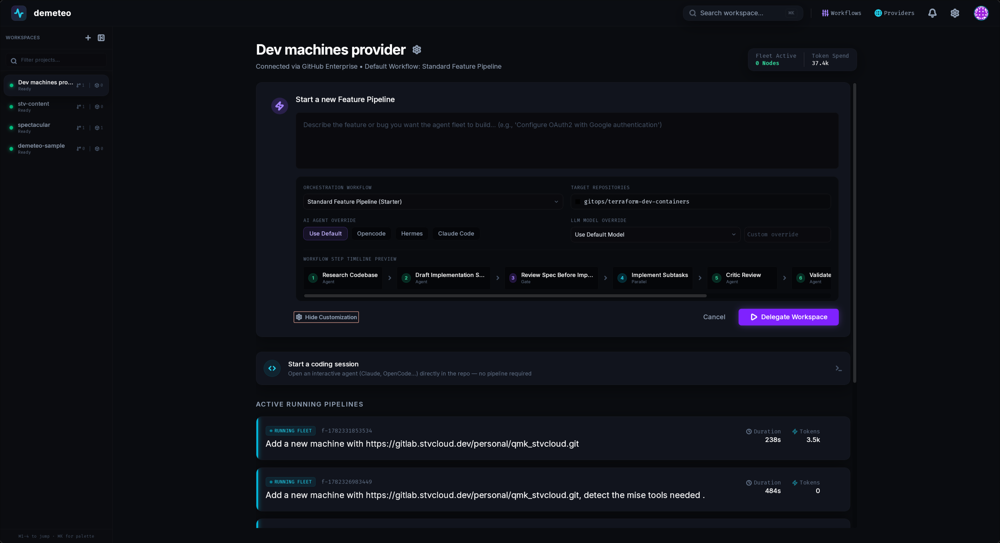

# Demeteo



Desktop control plane for orchestrating local and remote AI coding agents.

Describe a feature in plain language. Demeteo decomposes it into a versioned **Workflow** of **Steps**, runs each step in an isolated Git worktree via a coding agent, and presents **Gates** — human-approval checkpoints — before merging results back.

Built with Tauri v2 (Rust) + React 19 (TypeScript).

## Supported agents

Agents are invoked as one-shot CLI processes — no server, no handshake. They must be installed and pre-configured (API keys, model) on the host before use.

| Agent | CLI invocation used |
|-------|---------------------|
| [opencode](https://github.com/anomalyco/opencode) | `opencode run --format json` |
| [claude-code](https://claude.ai/code) | `claude --print --output-format stream-json` |
| [hermes](https://github.com/NousResearch/hermes-agent) | `hermes run --format json` |
| antigravity | `agy --print -` — **not currently supported** (CLI changed, integration broken) |

## Installation

Download the [latest release](https://github.com/stevenyepes/demeteo/releases/latest), or browse [all releases](https://github.com/stevenyepes/demeteo/releases).

**Linux (x86\_64)**

```bash
# Debian / Ubuntu
sudo dpkg -i demeteo_*.deb

# Fedora / RHEL / openSUSE
sudo rpm -i demeteo-*.rpm

# Any distro — AppImage (no install needed)
chmod +x demeteo_*.AppImage && ./demeteo_*.AppImage

# Arch Linux — use the PKGBUILD from the release assets
tar xf PKGBUILD -C demeteo-bin && cd demeteo-bin && makepkg -si
```

**macOS (Apple Silicon)**

Open the `.dmg`, drag Demeteo to Applications. Intel Macs are not currently supported.

**Windows (x86\_64)**

Run the `.msi` for a standard installer, or the `.exe` (NSIS) for a single-file install.

---

A nightly pre-release is published automatically on every push to `master` — use it for testing, not production.

## Prerequisites (building from source)

- [Rust](https://rustup.rs/) stable 1.77+
- Node.js 20+
- [Tauri v2 system dependencies](https://tauri.app/start/prerequisites/)
- At least one agent above installed and reachable from your `$PATH`

## Getting started

```bash
git clone https://github.com/stevenyepes/demeteo
cd demeteo
npm install
npm run dev:tauri
```

On first launch the local SQLite database is created and migrated automatically (`~/.local/share/demeteo/demeteo.db` on Linux; platform equivalent elsewhere).

## Development

| Task | Command |
|------|---------|
| Dev app (full) | `npm run dev:tauri` |
| Frontend only | `npm run dev` |
| Production build | `npm run tauri build` |
| Type-check | `npx tsc --noEmit` |
| Rust check | `cd src-tauri && cargo check` |
| Rust fmt | `cd src-tauri && cargo fmt` |
| Rust lint | `cd src-tauri && cargo clippy -- -D warnings` |

A change is considered done when `tsc --noEmit` and `cargo clippy` both exit 0 and the app boots without console errors.

## Architecture

```
React Webview ──IPC──► Tauri Commands ──► FeatureOrchestrator
                                               │
                           ┌───────────────────┤
                           ▼                   ▼
                     AgentRuntime        WorktreeManager
                     (CliRuntime)        (MergeExecutor)
                           │                   │
                   opencode / hermes     Git worktrees
                   claude-code / ag      SSH/SFTP repos
```

The codebase follows a hexagonal (ports & adapters) layout. See [`docs/ARCHITECTURE.md`](docs/ARCHITECTURE.md) for the full port catalogue and [`AGENTS.md`](AGENTS.md) for the project constitution and code conventions.

## Contributing

See [CONTRIBUTING.md](CONTRIBUTING.md). MIT licensed.
