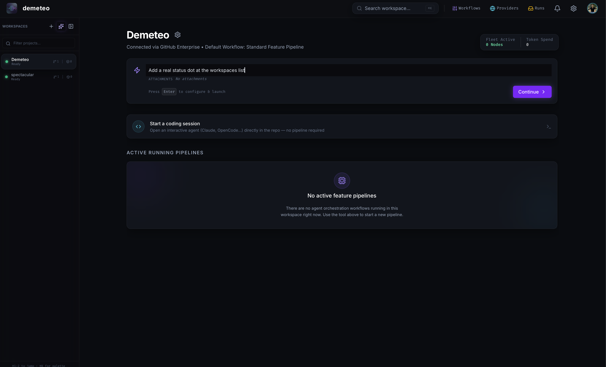
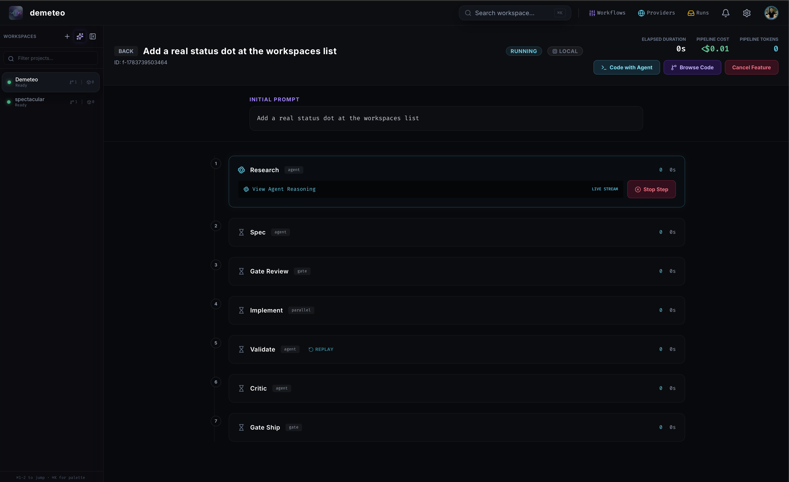
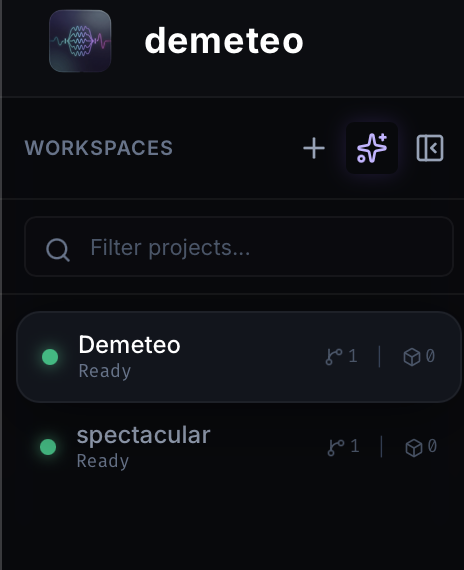

# Demeteo



Desktop control plane for orchestrating local and remote AI coding agents.

Describe a feature in plain language. Demeteo decomposes it into a versioned **Workflow** of **Steps**, runs each step in an isolated Git worktree via a coding agent, and presents **Gates** — human-approval checkpoints — before merging results back.

Built with Tauri v2 (Rust) + React 19 (TypeScript).

> 📖 Looking for usage docs? See the **[public wiki](https://stevenyepes.github.io/demeteo)** — covers starting a feature, creating a workspace, the settings surface, and the seven starter workflows.

## Supported agents

Agents are invoked as one-shot CLI processes — no server, no handshake. They must be installed and pre-configured (API keys, model) on the host before use.

| Agent | CLI invocation used |
|-------|---------------------|
| [opencode](https://github.com/anomalyco/opencode) | `opencode run --format json` |
| [claude-code](https://claude.ai/code) | `claude --print --verbose --output-format stream-json` |
| [hermes](https://github.com/NousResearch/hermes-agent) | `hermes run --format json` |
| [codex](https://github.com/openai/codex) | `codex exec --json` |

Want to add another agent? Every agent declares the same [capability contract](AGENT_INTEGRATION.md); see [`docs/adapters/CONTRIBUTING-AN-AGENT.md`](docs/adapters/CONTRIBUTING-AN-AGENT.md) for the step-by-step.

## Installation

Download the [latest release](https://github.com/stevenyepes/demeteo/releases/latest), or browse [all releases](https://github.com/stevenyepes/demeteo/releases).

**Linux (x86\_64)**

```bash
# Debian / Ubuntu
sudo dpkg -i demeteo_*.deb

# Fedora / RHEL / openSUSE
sudo rpm -i demeteo-*.rpm

# Any distro — AppImage (no install needed)
chmod +x demeteo_*.AppImage && ./demeteo_*.AppImage

# Arch Linux — use the PKGBUILD from the release assets
tar xf PKGBUILD -C demeteo-bin && cd demeteo-bin && makepkg -si
```

**macOS (Apple Silicon)**

Open the `.dmg`, drag Demeteo to Applications. Intel Macs are not currently supported.

> **"demeteo.app is damaged and can't be opened"?** This is expected. The app isn't
> notarized by Apple (that requires a paid Developer account), so macOS quarantines it on
> download. The app is not actually damaged — clear the quarantine flag once after installing:
>
> ```bash
> xattr -cr /Applications/demeteo.app
> ```
>
> Then open it normally. (Right-click → Open does **not** work for this case; only the command above does.)

**Windows (x86\_64)**

Run the `.msi` for a standard installer, or the `.exe` (NSIS) for a single-file install.

Local terminals open under `cmd.exe` (from `%COMSPEC%`, falling back to `cmd.exe`).
Agent-activity hooks are not injected into local Windows terminals — local agents
run unhooked, and their live working/waiting/needs-a-decision indicators come only
from the on-screen output scanner. (Agents on remote SSH hosts still run hooked;
that path is always POSIX.) See [`docs/TERMINAL_ACTIVITY_PLAN.md`](docs/TERMINAL_ACTIVITY_PLAN.md#windows-support).

---

A nightly pre-release is published automatically on every push to `master` — use it for testing, not production.

## Prerequisites (building from source)

- [Rust](https://rustup.rs/) stable 1.77+
- Node.js 20+
- [Tauri v2 system dependencies](https://tauri.app/start/prerequisites/)
- At least one agent above installed and reachable from your `$PATH` (Windows:
  `%PATH%`). On Windows, Demeteo also auto-enriches `PATH` at launch with the
  common per-user agent-install locations — `%APPDATA%\npm` (npm-global `.cmd`
  shims), `%LOCALAPPDATA%\Programs`, `%USERPROFILE%\.cargo\bin`, and
  `%USERPROFILE%\scoop\shims` — so GUI-launched agents are found even when the
  desktop session's `PATH` is minimal.

## Getting started

```bash
git clone https://github.com/stevenyepes/demeteo
cd demeteo
npm install
npm run dev:tauri
```

On first launch the local SQLite database is created and migrated automatically (`~/.local/share/com.stvcloud.demeteo/demeteo.db` on Linux; platform equivalent elsewhere).

## Development

| Task | Command |
|------|---------|
| Dev app (full) | `npm run dev:tauri` |
| Frontend only | `npm run dev` |
| Production build | `npm run tauri build` |
| Type-check | `npx tsc --noEmit` |
| Rust check | `cd src-tauri && cargo check` |
| Rust fmt | `cd src-tauri && cargo fmt` |
| Rust lint | `cd src-tauri && cargo clippy -- -D warnings` |

> **Important:** always use `npm run dev:tauri`, not `npm run tauri dev`. The `dev:tauri` script passes `--config src-tauri/tauri.dev.conf.json` which sets a separate app identifier (`com.stvcloud.demeteo.dev`), keeping the dev database and config isolated from the stable installed app.

A change is considered done when `tsc --noEmit` and `cargo clippy` both exit 0 and the app boots without console errors.

## Architecture

```
React Webview ──IPC──► Tauri Commands ──► StepExecutor
                                               │
                           ┌───────────────────┤
                           ▼                   ▼
                     AgentRuntime        WorktreeOpsPort
                     (UnifiedCliRuntime)  + Merge / Conflict
                           │               + MrPublisher
                   opencode / hermes     Git worktrees
                   claude-code           SSH/SFTP repos
```

The codebase follows a hexagonal (ports & adapters) layout. See [`docs/ARCHITECTURE.md`](docs/ARCHITECTURE.md) for the full port catalogue and [`AGENTS.md`](AGENTS.md) for the project constitution and code conventions.

## Screenshots

| | |
|---|---|
|  |  |
| **Feature pipeline** — the Standard pipeline's seven steps, with live telemetry (elapsed duration, cost, tokens) and the *Code with Agent*, *Browse Code*, and *Cancel Feature* controls. | **Workspaces sidebar** — the `+` button creates a new workspace (with a guided wizard that auto-launches the Standard pipeline). |

## Project memory (Memory Agent)

Demeteo can learn from each run. As features execute, it captures **signals** —
human gate feedback, step failures/retries, and agent run summaries — into a
queue. An opt-in background **Memory Agent** distills those signals into typed
project memories (conventions, lessons, decisions, preferences, facts), embeds
them, and injects the most relevant ones into future agent prompts via semantic
search.

The Memory Agent runs against a **local or OpenAI-compatible LLM you configure**
(e.g. [Ollama](https://ollama.com)) — it is the one place Demeteo calls a model
provider directly, is disabled by default, and stores its API key in the OS
keyring. Enable and configure it under **Preferences → Memory** (set a chat model
like `llama3.1` and an embeddings model like `nomic-embed-text`, then **Test
connection**). Per-project memories are viewable and editable under **Project
Settings → Project Memory**.

## Contributing

See [CONTRIBUTING.md](CONTRIBUTING.md). MIT licensed.
