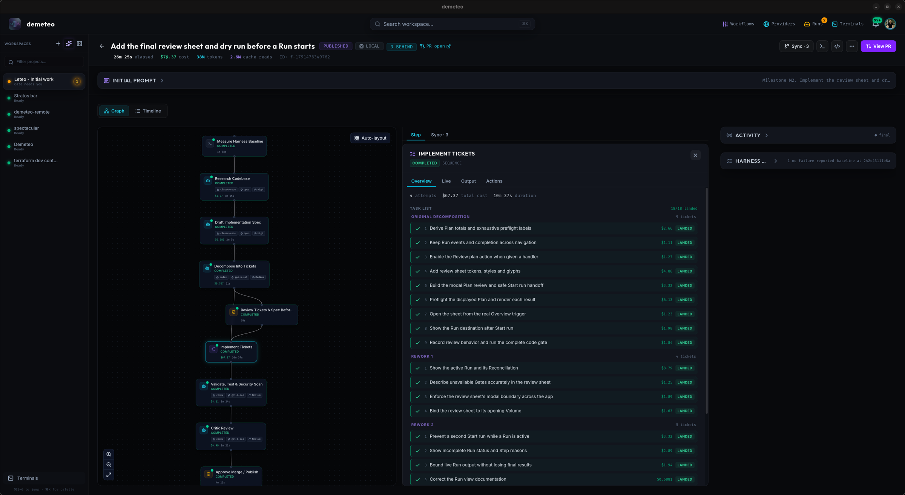
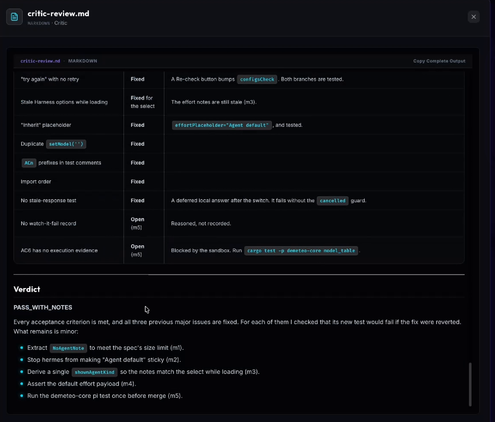
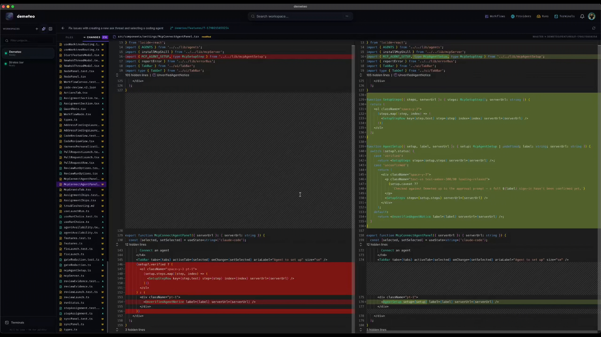
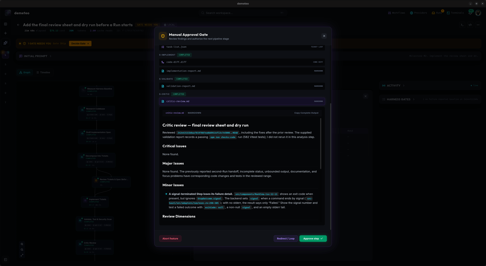
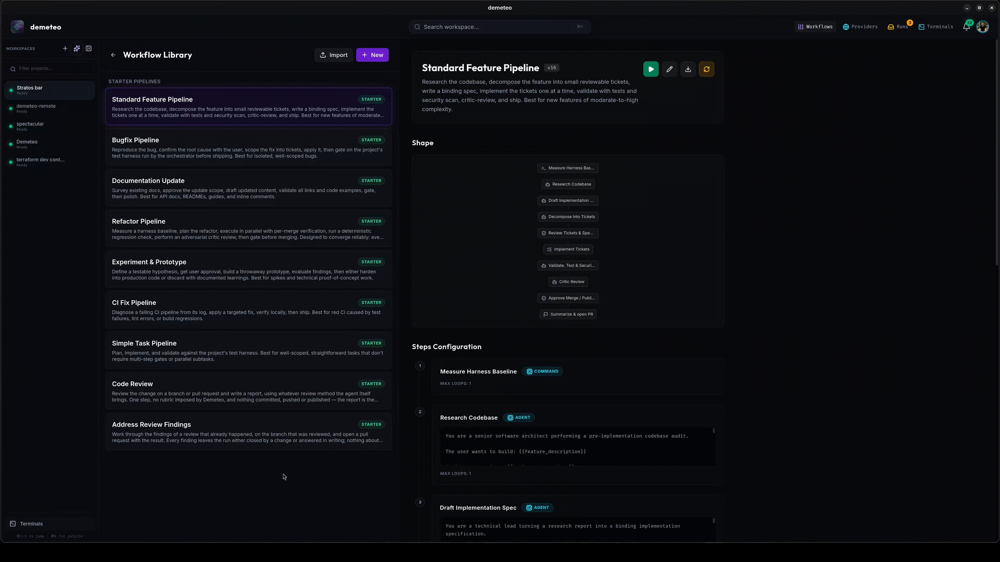
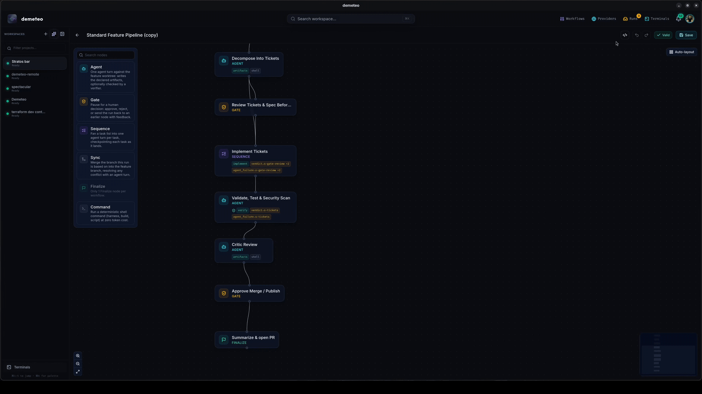
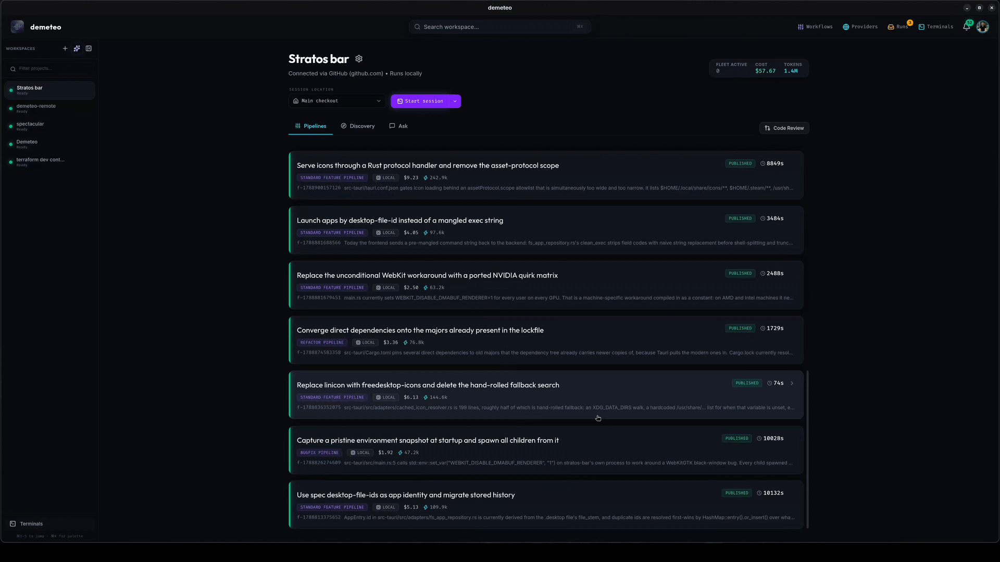
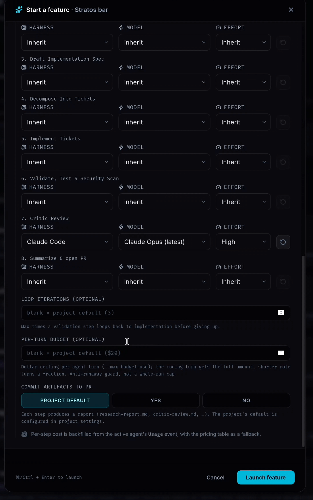
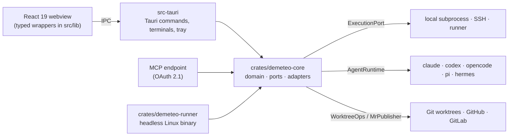

# Demeteo

**A desktop control plane for coding agents.** Describe what you want built; Demeteo
interviews you, breaks the work into dependency-gated tickets, runs each one through a
reviewable pipeline of agents in its own Git worktree, and stops at human-approval
**Gates** before anything merges. You make the calls — the agents do the execution.


Works with **Claude Code, Codex, OpenCode, Hermes and pi**, locally, on a machine over
SSH, or on a headless runner. Built with Tauri v2 (Rust) + React 19 (TypeScript). MIT licensed.

> 📖 Usage docs live in the **[wiki](https://stevenyepes.github.io/demeteo)** ·
> 🎥 Full walkthrough, from idea to 52 tickets (Spanish, 18 min): **[youtu.be/PDLcUuBeC6A](https://youtu.be/PDLcUuBeC6A)**

---

## Why

One-shotting an app of any size gets you a good demo, and then the second feature breaks
the first. Demeteo is built around the opposite bet: settle the decisions up front, split
the work into pieces an agent can finish, give every piece the same research → spec →
review → implement → validate → critique path, and keep a human at the points that
matter. Every step leaves an artifact you can read, and every run is reproducible from
the Workflow that drove it.

## How it works

```
 Discovery            Tickets                 Pipeline (per ticket)                     You
┌──────────┐   ┌─────────────────────┐   ┌─────────────────────────────────────┐   ┌────────┐
│ interview│──►│ dependency-gated DAG│──►│ baseline → research → spec → tickets│──►│  Gate  │──► merge / PR
│ + decide │   │ apply when you say  │   │ → implement → validate → critic     │   │approve │
└──────────┘   └─────────────────────┘   └─────────────────────────────────────┘   └────────┘
                                          one Git worktree per Subtask, in parallel
```

### 1 · Discovery — the agent interviews you first

Start from a prompt (and mockups, if you have them). An interviewer agent asks about what
you haven't decided yet, writes down the defaults it picked so you can correct them, and
says so when nothing is left to settle.


### 2 · Decompose — tickets with reasons and dependencies

A decompose pass turns the conversation into tickets, each with a reason, a Workflow and
its prerequisites. Nothing is applied until you click apply; ticket ids are stable, so
re-planning never renumbers.


Each ticket starts only when the ones it depends on have landed, and says what it is
waiting on. Until it starts, every ticket is yours to edit — title, description,
acceptance criteria, file scope, test command, attachments, and its own workflow, agent,
model and effort. Then pick any ready tickets and run them in parallel, each in its own
worktree; once a ticket has a feature it locks, and changes go in a follow-up ticket.


### 3 · Pipeline — every ticket takes the same path

The default **Standard Feature Pipeline** measures the repo's own harness baseline,
researches the code, drafts a spec, decomposes it into tasks, stops at a review gate,
implements the tasks in a loop, validates them against your project's checks, and hands
the result to a **critic** agent whose only job is finding what the others got wrong.

| | |
|---|---|
|  |  |
| **Pipeline view** — live step graph, elapsed time, cost and tokens; a banner when a gate is waiting on you. This run is detached on a remote runner and renders the same as a local one. | **Implement** — one fresh agent per ticket, each with its cost; validation failures come back as rework rounds. |
|  |  |
| **Critic** — reads the landed code, not just the reports, and checks every acceptance criterion against evidence. | **Browse Code** — the feature branch's diff, in the app. |

### 4 · Gates — you decide what merges

A Gate shows every artifact the pipeline produced so far — here the ship gate, with the
critic's review open beside the diff, validation report and task list. Approve, redirect
it back into a loop with feedback, or abort. Per project, **gate autonomy** sets how much
of this is yours: `attended` (every gate waits — the default), `review` (only the ship
gate waits), or `full`.



### Workflows are yours to change

Pipelines are versioned DAGs of Steps (`agent`, `gate`, `sequence`, `command`, `sync`,
`finalize`). Nine starters ship with the app — Standard Feature, Bugfix, Documentation
Update, Refactor, Experiment & Prototype, CI Fix, Simple Task, Code Review and Address
Review Findings — and any of them can be copied and edited on the canvas.

| | |
|---|---|
|  |  |

### And around it

| | |
|---|---|
|  |  |
| **Projects** — every feature with its Workflow, where it ran, cost, tokens and duration. Pipelines, Discovery and Ask live side by side. | **Per-step overrides** — a different harness, model and effort for any step (e.g. a stronger model only for the critic). |
|  |  |
| **Create a project** — a guided, one-decision-at-a-time setup: provider, machine, agent, model, then the first feature. | **MCP** — turn the endpoint on, copy the connect steps for your agent, and revoke any client's grant. |

- **Remote execution** — run agents on another machine over SSH, or hand a whole run to
  `demeteo-runner`, a headless Linux binary that keeps going with your laptop closed.
  Every transport behaves identically ([docs/EXECUTION_PARITY.md](docs/EXECUTION_PARITY.md)).
- **Embedded terminals** — xterm tabs, local or over SSH, that show whether the agent
  inside is working, waiting, or needs a decision.
- **MCP endpoint** — an opt-in, OAuth-protected MCP server so another agent can list
  projects, read run state and start features or tickets. Approving gates and merging are
  deliberately not exposed ([docs/MCP_INTEGRATION.md](docs/MCP_INTEGRATION.md)).
- **Pull requests** — GitHub and GitLab publishing, with PR state shown in the list.
- **Project memory** — an opt-in Memory Agent distils gate feedback, failures and run
  summaries into project memories that are injected into future prompts. It runs against a
  local or OpenAI-compatible model you configure (e.g. [Ollama](https://ollama.com)) under
  **Preferences → Memory**.

## Supported agents

Agents run as one-shot CLI processes that emit JSON — no server, no handshake. Install and
sign in to them on the host (or remote machine) first; Demeteo never edits their own
config, and passes model and effort per invocation.

| Agent | Invocation | Effort |
|-------|------------|--------|
| [Claude Code](https://claude.ai/code) | `claude --print --output-format stream-json` | ✓ |
| [Codex](https://github.com/openai/codex) | `codex exec --json` | ✓ |
| [OpenCode](https://github.com/anomalyco/opencode) | `opencode run --format json` | ✓ |
| [pi](https://github.com/earendil-works/pi-mono) | `pi --mode json` | ✓ |
| [Hermes](https://github.com/NousResearch/hermes-agent) | `hermes run --format json` | — |

Adding another agent means declaring the same [capability contract](AGENT_INTEGRATION.md);
see [docs/adapters/CONTRIBUTING-AN-AGENT.md](docs/adapters/CONTRIBUTING-AN-AGENT.md).

## Installation

Download the [latest release](https://github.com/stevenyepes/demeteo/releases/latest)
([all releases](https://github.com/stevenyepes/demeteo/releases)). A nightly pre-release
is published on every push to `master` — for testing, not production.

**Linux (x86\_64)**

```bash
sudo dpkg -i demeteo_*.deb                          # Debian / Ubuntu
sudo rpm -i demeteo-*.rpm                           # Fedora / RHEL / openSUSE
chmod +x demeteo_*.AppImage && ./demeteo_*.AppImage # any distro
```

**macOS (Apple Silicon)** — open the `.dmg` and drag Demeteo to Applications. Intel Macs
are not supported.

> **"demeteo.app is damaged and can't be opened"?** Expected: the app isn't notarized, so
> macOS quarantines it on download. Clear the flag once — right-click → Open does **not**
> work for this case:
>
> ```bash
> xattr -cr /Applications/demeteo.app
> ```

**Windows (x86\_64)** — the `.msi` installer or the NSIS `.exe`. Local terminals open
under `cmd.exe`, and local agents run without activity hooks (indicators come from the
output scanner) — see [docs/TERMINAL_ACTIVITY.md](docs/TERMINAL_ACTIVITY.md#windows-support).
Demeteo adds the usual per-user agent install locations (`%APPDATA%\npm`,
`%USERPROFILE%\.cargo\bin`, scoop shims, …) to `PATH` at launch.

**Headless runner** — each release also ships `demeteo-runner-x86_64-unknown-linux-musl`
(plus a `.sha256`), a static binary for running pipelines on a Linux server. See
[docs/REMOTE_EXECUTION.md](docs/REMOTE_EXECUTION.md).

## Building from source

Prerequisites: [rustup](https://rustup.rs/) (the toolchain is pinned in
`rust-toolchain.toml` and installs itself), Node.js 24, the
[Tauri v2 system dependencies](https://tauri.app/start/prerequisites/), and at least one
agent above on your `PATH`.

```bash
git clone https://github.com/stevenyepes/demeteo
cd demeteo
npm install
npm run dev:tauri
```

> Use `npm run dev:tauri`, **not** `npm run tauri dev`: only the former loads
> `src-tauri/tauri.dev.conf.json`, whose separate app identifier keeps the dev database
> apart from an installed Demeteo.

The SQLite database is created and migrated on first launch, in the platform data dir
under `com.stvcloud.demeteo` (`.dev` for dev builds).

| Task | Command |
|------|---------|
| Run the app | `npm run dev:tauri` |
| Frontend only | `npm run dev` |
| Every gate CI runs | `npm run checks` |
| Frontend / Rust half | `scripts/checks.sh frontend` · `scripts/checks.sh rust` |
| Frontend tests · lint | `npm test` · `npm run lint` |
| Headless runner (musl) | `npm run build:runner` |
| Production build | `npm run tauri build` |

A change is done when `npm run checks` exits 0 and the app boots without console errors.
[AGENTS.md](AGENTS.md) holds the invariants, conventions and the full verification policy —
read it before your first PR.

## Architecture

A Cargo workspace laid out as a hexagon (ports & adapters):


```mermaid
flowchart LR
  UI["React 19 webview<br/>(typed wrappers in src/lib)"] -- IPC --> TAURI["src-tauri<br/>Tauri commands, terminals, tray"]
  TAURI --> CORE["crates/demeteo-core<br/>domain · ports · adapters"]
  MCP["MCP endpoint<br/>(OAuth 2.1)"] --> CORE
  RUNNER["crates/demeteo-runner<br/>headless Linux binary"] --> CORE
  CORE -- ExecutionPort --> EXEC["local subprocess · SSH · runner"]
  CORE -- AgentRuntime --> AGENTS["claude · codex · opencode · pi · hermes"]
  CORE -- WorktreeOps / MrPublisher --> GIT["Git worktrees · GitHub · GitLab"]
```

Start with [docs/ARCHITECTURE.md](docs/ARCHITECTURE.md) for the port catalogue and
[docs/DDD_MODEL.md](docs/DDD_MODEL.md) for the vocabulary (Project, Feature, Workflow,
Step, Subtask, Gate). [AGENTS.md §8](AGENTS.md#8-documentation-index) maps every other
design doc.

## Contributing

See [CONTRIBUTING.md](CONTRIBUTING.md). Commits follow Conventional Commits and drive
release versioning. MIT licensed.
