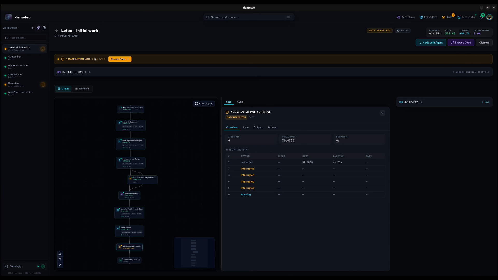

# Getting started

## Prerequisites

- **Linux x86_64, macOS on Apple Silicon, or Windows x86_64.** Intel Macs are not supported.
- **At least one coding agent**, installed and signed in on the machine that will run it: [Claude Code](https://claude.ai/code), [Codex](https://github.com/openai/codex), [OpenCode](https://github.com/anomalyco/opencode), [pi](https://github.com/earendil-works/pi-mono) or [Hermes](https://github.com/NousResearch/hermes-agent). Demeteo never edits their own config; it passes model and effort per invocation.
- **A GitHub or GitLab account** and a Personal Access Token. Projects are created from (or into) a connected provider.

## Install

Download the [latest release](https://github.com/stevenyepes/demeteo/releases/latest) ([all releases](https://github.com/stevenyepes/demeteo/releases)). A nightly pre-release is published on every push to `master` — for testing, not production.

### Linux (x86_64)

```bash
sudo dpkg -i demeteo_*.deb                          # Debian / Ubuntu
sudo rpm -i demeteo-*.rpm                           # Fedora / RHEL / openSUSE
chmod +x demeteo_*.AppImage && ./demeteo_*.AppImage # any distro
```

### macOS (Apple Silicon)

Open the `.dmg` and drag Demeteo to Applications.

!!! warning "\"demeteo.app is damaged and can't be opened\""
    Expected: the app isn't notarized, so macOS quarantines it on download. Clear the flag once — right-click → Open does **not** work for this case:

        xattr -cr /Applications/demeteo.app

### Windows (x86_64)

Use the `.msi` installer or the NSIS `.exe`. Local terminals open under `cmd.exe`, and local agents run without activity hooks (indicators come from the output scanner). Demeteo adds the usual per-user agent install locations (`%APPDATA%\npm`, `%USERPROFILE%\.cargo\bin`, scoop shims, …) to `PATH` at launch.

### Headless runner (optional)

Each release also ships `demeteo-runner-x86_64-unknown-linux-musl` (plus a `.sha256`), a static binary for running pipelines on a Linux server. You normally don't install it by hand: **Settings → Machines → Enable remote runs** pushes it to a machine for you (see [Settings](settings.md#machines)).

## First run

### 1. Connect a provider

Open **Providers** in the top bar and add a GitHub or GitLab connection with a Personal Access Token (and a host URL for self-hosted instances). The token is stored in the OS keyring, never on disk.

If agents should run somewhere other than this computer, add the machine under **Settings → Machines** too (the avatar menu → *Settings*, or <kbd>⌘</kbd>/<kbd>Ctrl</kbd> + <kbd>,</kbd>).

### 2. Create a project

In the left rail, next to *Workspaces*:

- **`+`** (*Bootstrap Project*) connects repositories that already exist on your provider.
- **✦** (*New from zero*) opens a seven-step guided setup that creates the repository and launches its first feature.


[Creating a project](journeys/create-a-workspace.md) walks through both paths.

### 3. Give it work

A project's home has three tabs — **Pipelines**, **Discovery** and **Ask**.

- **Know what you want?** Type it into the composer on the *Pipelines* tab (or press <kbd>⌘</kbd>/<kbd>Ctrl</kbd> + <kbd>T</kbd>), pick a workflow and launch. See [Starting a feature](journeys/start-a-feature.md).
- **Bigger or fuzzier?** Start a Discovery: an interviewer agent asks what you haven't decided, then decomposes the conversation into dependency-gated tickets you start one by one. See [Running a Discovery](journeys/run-a-discovery.md).

### 4. Approve gates

The pipeline runs on its own until it reaches a **Gate**. A banner says *GATE NEEDS YOU*, and the project shows *Gate needs you* in the sidebar. Open the gate, read the artifacts the earlier steps wrote, and choose **Approve step**, **Redirect / Loop** (with feedback), or **Abort feature**.



If you'd rather not be asked at every gate, set **gate autonomy** per project — see [Settings](settings.md#agent-strategy-policies).

## Next steps

- [Workflows](workflows.md) — the nine starters and how a step is put together.
- [Settings](settings.md) — machines, providers, MCP, and per-project policies.
- [Building from source](https://github.com/stevenyepes/demeteo#building-from-source) — in the repository README.
