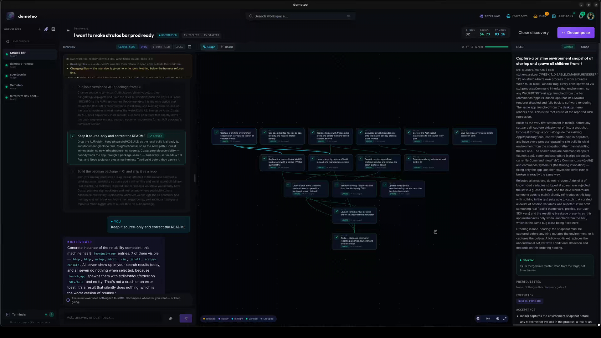

# Demeteo

**A desktop control plane for coding agents.** Describe what you want built; Demeteo interviews you, breaks the work into dependency-gated tickets, runs each one through a reviewable pipeline of agents in its own Git worktree, and stops at human-approval **Gates** before anything merges. You make the calls — the agents do the execution.

[Get started](getting-started.md){ .md-button }
[View on GitHub](https://github.com/stevenyepes/demeteo){ .md-button .md-button--primary }

Works with **Claude Code, Codex, OpenCode, Hermes and pi**, locally, on a machine over SSH, or on a headless runner. Built with Tauri v2 (Rust) + React 19 (TypeScript). MIT licensed.

## Why Demeteo

One-shotting an app of any size gets you a good demo, and then the second feature breaks the first. Demeteo is built around the opposite bet: settle the decisions up front, split the work into pieces an agent can finish, give every piece the same research → spec → review → implement → validate → critique path, and keep a human at the points that matter. Every step leaves an artifact you can read, and every run is reproducible from the Workflow that drove it.

## What's in the box

| | |
|---|---|
| **Discovery** | An interviewer agent asks about what you haven't decided yet, then a decompose pass turns the conversation into dependency-gated tickets. See [Running a Discovery](journeys/run-a-discovery.md). |
| **Workflows** | Versioned DAGs of Steps. Nine starters ship with the app; copy and edit any of them on the canvas. See [Workflows](workflows.md). |
| **Gates** | Approve, redirect back into a loop with feedback, or abort. Per project, **gate autonomy** (`attended` / `review` / `full`) sets which gates wait for you. |
| **Remote execution** | Run agents on another machine over SSH, or hand a whole run to `demeteo-runner`, a headless Linux binary that keeps going with your laptop closed. Every transport behaves identically. |
| **Code Review** | Review an open pull request with the agent's own review method, then address the findings in a follow-up run. |
| **MCP endpoint** | An opt-in, OAuth-protected MCP server so another agent can list projects, read run state and start features or tickets. Approving gates and merging are deliberately not exposed. |
| **Terminals** | Embedded xterm tabs, local or over SSH, that show whether the agent inside is working, waiting, or needs a decision. |
| **Project memory** | An opt-in Memory Agent distils gate feedback, failures and run summaries into memories injected into future prompts. |

## Core concepts

| Term      | What it is |
|-----------|------------|
| Project   | A Git repository (or several) Demeteo tracks, bound to the machine its agents run on. The sidebar lists them under *Workspaces*. |
| Discovery | An interview with an agent that ends in a set of dependency-linked tickets. Each ticket becomes a Feature when you start it. |
| Feature   | One run of a Workflow against a user-described piece of work, on its own branch. |
| Workflow  | A reusable, versioned DAG of Steps. |
| Step      | One node in the DAG: `agent`, `gate`, `sequence`, `command`, `sync`, or `finalize`. |
| Gate      | A human-approval checkpoint before the orchestrator continues. |
| Subtask   | Work assigned to one agent in one worktree. |

For the full domain glossary, see [`docs/DDD_MODEL.md`](https://github.com/stevenyepes/demeteo/blob/master/docs/DDD_MODEL.md) in the repository.
