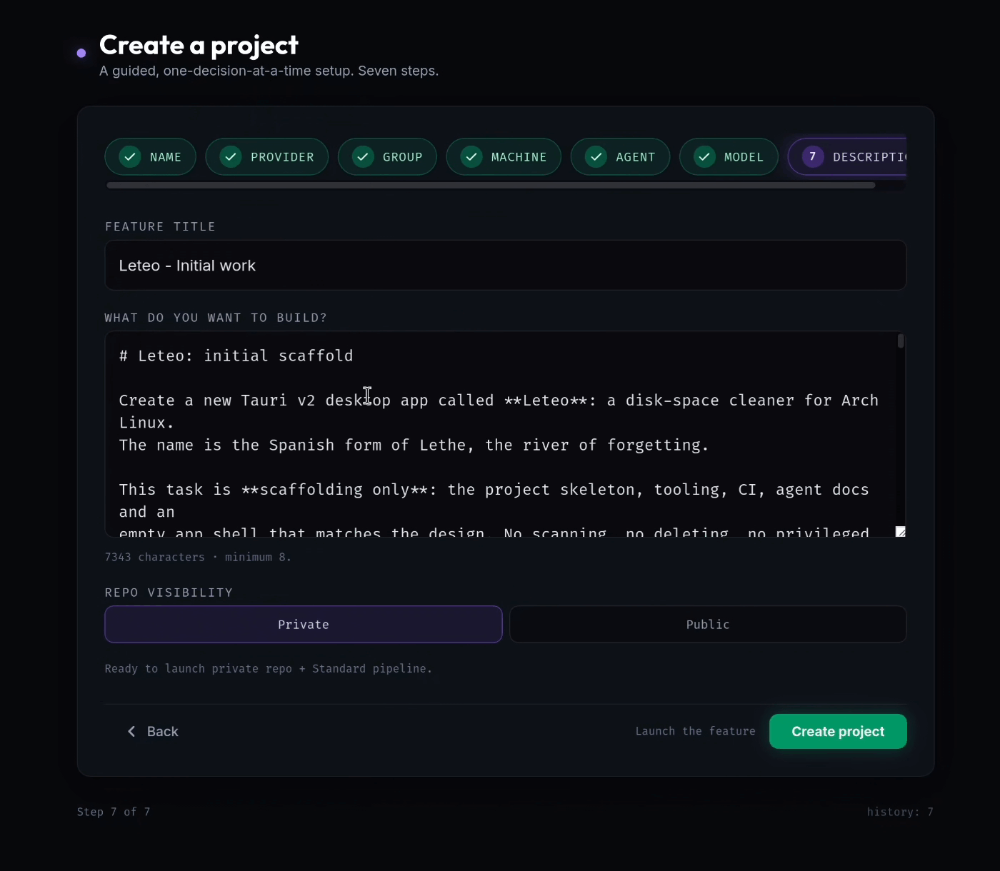

# Creating a project

A **project** pairs one or more Git repositories with the machine its agents run on. Projects are listed in the left rail under *Workspaces*, and everything you start — features, Discoveries, Ask threads — belongs to one.

You need a [connected provider](../settings.md#providers) (GitHub or GitLab) first.

## Two ways in

Next to the *Workspaces* header in the left rail:

- **`+`** (*Bootstrap Project*) — connect repositories that already exist on your provider.
- **✦** (*New from zero*) — create a new repository with a guided setup that ends with its first feature running.

<kbd>⌘</kbd>/<kbd>Ctrl</kbd> + <kbd>N</kbd> opens Project Bootstrap, which also links to the from-zero setup.

### 1. Connect existing repositories

The **Project Bootstrap** screen asks for:

- **Project Name** — what the rail shows.
- **Environment / Target Server** — *This machine*, or a remote SSH machine you've [configured](../settings.md#machines).
- **Select Repositories** — from your connected providers. A project can map more than one.

Demeteo then clones the repositories into your [workspace storage directory](../settings.md#defaults), reads the branch configuration and any PR template, and proposes a **worktree strategy** you can approve or edit: default branch, branch prefix, default test command, detected validation gates, and what happens to a completed feature (archive by default / keep active / auto-delete the branch after the PR merges).

### 2. Create from zero

The guided setup asks **one decision per screen**, in seven steps:

1. **Name** — the project and repository name.
2. **Provider** — a connected Git provider.
3. **Group** — your personal account, or an organization / group.
4. **Machine** — *Local compute* (this workstation) or *Remote SSH* (a configured machine).
5. **Agent** — the default coding agent, from those available.
6. **Model** — the model that agent will use.
7. **Description** — the first feature's title, what you want to build, and the repository's visibility.

**Create project** creates the repository and **launches the Standard Feature Pipeline** against it, so you go from no project to a first feature running in one click.

## After creation

The project appears in the left rail with a status:

| Status | Meaning |
|--------|---------|
| **Ready** | Idle and ready for work. |
| **Bootstrapping** | The initial clone and detection are still running. |
| **Running** | At least one run is active. Hover for the count. |
| **Gate needs you** | A run is parked at a gate waiting for your decision. |
| **Error** | Bootstrap failed. Open the project for the reason and *Retry Bootstrap*. |

Per-project settings — default workflow, agent and model, gate autonomy, harnesses — live under **Project Settings**; see [Settings](../settings.md#project-settings).
