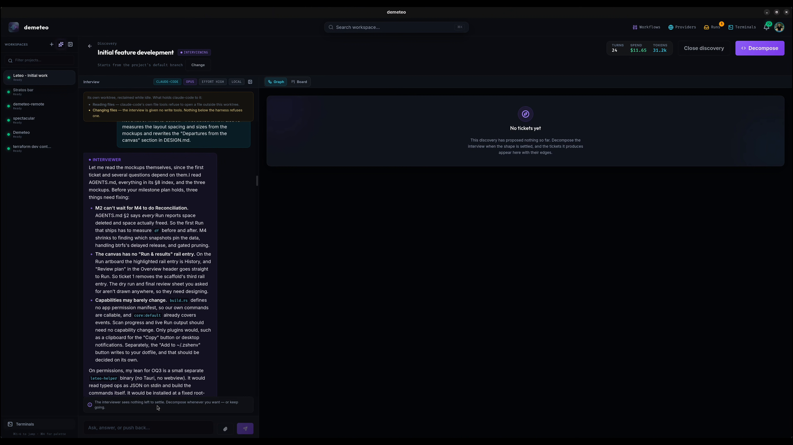
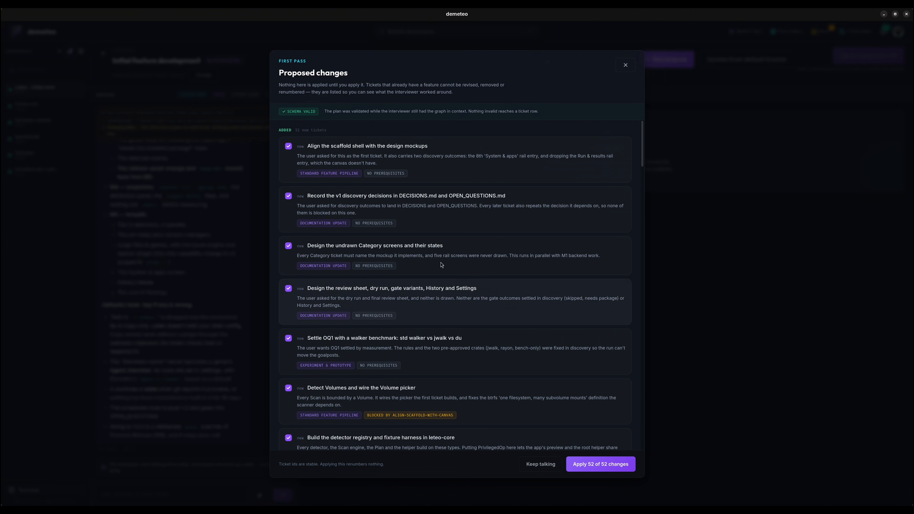
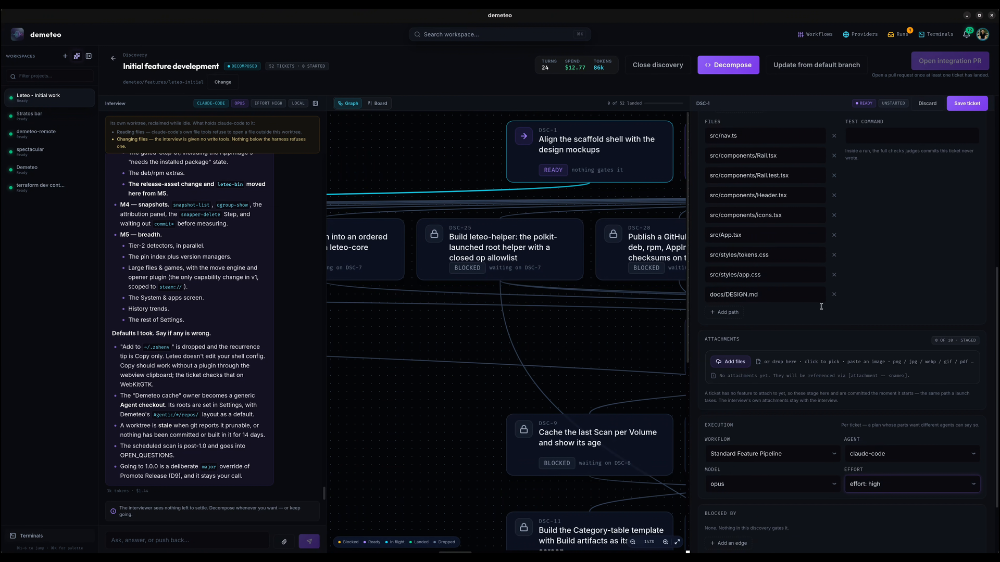

# Running a Discovery

A **Discovery** is where you think before you build. An interviewer agent asks about what you haven't decided yet, a decompose pass turns the conversation into **dependency-gated tickets**, and each ticket becomes a [feature](start-a-feature.md) when you start it. Use it for work too big or too fuzzy for one pipeline run.

## 1. Start one

On a project's home, open the **Discovery** tab and click **New discovery**:

| Field | Notes |
|-------|-------|
| **Name this discovery** | A label for your list — the interviewer never reads it. Say the idea itself in the first message. |
| **Interviewer**, **Model**, **Effort** | The agent that runs the interview, and how. |
| **Machine** | Where the interview's turns run. Also the default placement for its tickets (see [step 5](#5-start-ready-tickets)). |
| **Base branch** | The project's default branch, or a named integration branch: tickets cut their branches from it and merge back into it. It can be changed until the first ticket starts. |
| **Attachments** | Mockups, screenshots, documents for the interviewer. |

**Start discovery** opens the Discovery workspace.

## 2. The interview

The interview column is a conversation, not a terminal. Write your idea in the composer (*Ask, answer, or push back…*) and the interviewer reads the repository and asks about what is still open — often as a question card with options to pick from, or *Something else* in your own words. It also writes down the defaults it chose, so you can correct them.

- The interview runs in **its own worktree** and is given **no write tools**: it can read files and run commands to check a fact, but it doesn't change the repository. A banner at the top of the column says what holds the agent to that on your platform.
- Each turn is a fresh one-shot agent invocation that resumes the conversation, so you can leave a Discovery for days and pick it up again. A notification tells you when a turn finishes.
- The header shows the Discovery's **turns, spend and tokens**.

When the interviewer believes nothing is left to settle, it says so (*The interviewer sees nothing left to settle. Decompose whenever you want — or keep going.*). That is advice: **you** decide when to decompose, and you can do it from the first turn.

## 3. Decompose and review the proposed changes

**Decompose** runs a pass that turns the conversation into tickets. Nothing is applied yet — you get a **Proposed changes** view:

- Each ticket has a title, a **reason**, a **workflow**, and its **prerequisites** (*No prerequisites*, or *Blocked by …*).
- The plan is schema-validated while the interviewer still has it in context, so a malformed list or a dependency cycle never reaches a ticket.
- Untick anything you don't want, then **Apply N of M changes** — or **Keep talking** to go back to the interview.

A Discovery stays open after decomposing. **Decompose again** proposes changes on top of what exists: tickets that already have a feature are never revised, removed or renumbered, and ticket ids are stable, so applying renumbers nothing.

## 4. The ticket graph

Tickets appear as a **Graph** (what depends on what) or a **Board** with one lane per state:

| State | Meaning |
|-------|---------|
| **Blocked** | A prerequisite hasn't landed. The card says what it is waiting on. |
| **Ready** | Every prerequisite has landed or been dropped. |
| **In flight** | Started, and its PR hasn't merged or closed yet. |
| **Landed** | Its feature's PR was merged. |
| **Dropped** | You decided not to do it, with a reason — or its PR was closed without merging. |

A prerequisite counts as satisfied when its feature's PR is **merged or closed**, or the ticket was **dropped** — read from your Git provider, not from the run's own report, so expect a couple of minutes between a merge and the unblock. A ticket whose prerequisite has no PR stays blocked.

Select a ticket to inspect it — description, prerequisites, workflow, acceptance criteria, and **what its agent will be told** — and **Edit** it. Until it starts, every field is editable: title, description, acceptance, files, test command, prerequisite edges, attachments for the agent that implements it, and its execution settings (**workflow, agent, model, effort**, and the machine it runs on). A ticket locks once it has a feature.

## 5. Start ready tickets

**Start ticket** on a ready ticket creates a feature from the ticket's own workflow, agent, model and effort, and runs it like any other pipeline — gates included. Pick any ready tickets and run them side by side; each gets its own branch and worktree. Demeteo shows what is startable but **never starts a ticket on its own**.

- **Placement**: a ticket runs locally, or *detached* on a machine's `demeteo-runner`. Unless you choose, it inherits from the Discovery's machine.
- Every started ticket's prompt says, per prerequisite, whether it landed or was dropped, so the agent doesn't build on work that never reached its base.
- **Force start…** starts a blocked ticket anyway, and **Drop** gives up on one; both ask for a reason that is recorded on the ticket. A dropped ticket releases the tickets that depend on it. In a project with no forge remote, this is how the graph is driven.

## Integration branch and closing

If the Discovery uses a named base branch, its header adds **Update from default branch** (merge the default branch into it) and **Open integration PR** (a pull request from the integration branch to the default branch, available once at least one ticket has landed).

**Close discovery** ends the interview and keeps everything — tickets, transcript and features. It can be reopened.
