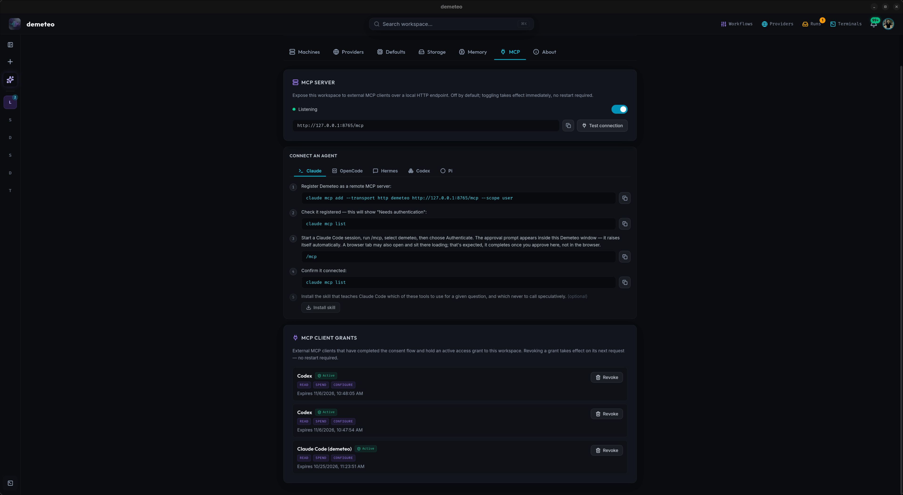

# Settings

Demeteo has two settings surfaces:

- **Preferences** — global, app-wide configuration. Open it from the avatar menu at the right of the top bar (*Settings*), or with <kbd>⌘</kbd>/<kbd>Ctrl</kbd> + <kbd>,</kbd>.
- **Project Settings** — per project. Open it with the gear icon next to the project's name on its home.

## Preferences

The Preferences screen has seven tabs along the top: **Machines**, **Providers**, **Defaults**, **Storage**, **Memory**, **MCP** and **About**.

### Machines

The **hosts where agents can run**: *This Machine* (built in, runs agents directly on this computer) plus any remote machines you add over SSH, with password or private-key auth. *Test SSH connection* checks a machine before you use it.

- **Enable remote runs** installs `demeteo-runner` on a remote machine as a systemd `--user` service, so runs can be *detached* to it and keep going with your laptop closed. Demeteo pushes a runner binary it already has — a dev build, the `$DEMETEO_RUNNER_BIN` override, or one next to the app — or downloads the release that matches your app version. **Upgrade runner** pushes the latest build and restarts it.
- Each machine's runner status reads **Running**, **Installed, stopped**, or **Installed**, with its version and a warning when it is older or newer than the app.
- If you see an amber warning that *lingering isn't enabled*, an administrator must run `loginctl enable-linger <user>` on that machine; without it the runner stops when you log out of SSH and won't start on reboot.

### Providers

Git hosting providers — **GitHub** and **GitLab**, including self-hosted instances via a host URL. Demeteo uses them to list and create repositories, push feature branches, and open pull requests. The tab links to the full **Providers** page (also in the top bar).

Each provider's **Personal Access Token is stored in the OS keyring** — never in SQLite or on disk.

### Defaults

| Setting | What it controls |
|---------|------------------|
| **Workspace Storage** | Directory where Demeteo clones project repositories. Defaults to the app data directory; set a custom path to use, e.g., a faster SSD. Restart the app after changing it; existing projects need re-bootstrapping if you move it. |
| **Default Agent & Model** | Set per project, in **Project Settings → Agent Strategy & Policies**. There is no global default yet. |
| **Agent Timeouts** | Three global thresholds (in seconds) applied to every agent turn: **Fast (blocked)** — fires when stdout and stderr are both silent; **Normal (no event)** — no event ever received; **Wall cap** — absolute upper bound. Raise *Fast* if long-running tasks are being killed too eagerly. |
| **Run in background** | Minimize to the system tray when the window closes instead of quitting. Terminal sessions stay alive and events arrive as native OS notifications. |

### Storage

**Dependency Caches & Worktrees** — what runs, Ask threads and Discoveries left beside each project's clone, and whether anything still needs it. Each entry is *Reclaimable*, *Kept*, or *Undecided — left for you*. **Rescan** re-checks; **Reclaim** deletes what is reclaimable. A sweep also runs every 6 hours in the background.

### Memory

The **Memory Agent** — an opt-in background process that distils gate feedback, failures and run summaries into project memories that are injected into future prompts.

Enable it and point it at any **OpenAI-compatible local or remote LLM** ([Ollama](https://ollama.com) is the common choice): a chat endpoint and model (e.g. `llama3.1`), an embeddings endpoint (blank uses the chat one) and model (e.g. `nomic-embed-text`), and an API key if the endpoint needs one (leave it blank for local models). The Memory Agent is the one place Demeteo calls a model provider directly; its API key is kept in the OS keyring.

Per-project memories are viewable and editable under **Project Settings → Project Memory**.

### MCP

An opt-in **MCP server**, so another agent (Claude Code, Codex, OpenCode, Hermes, pi) can list projects, read run state, and start features or tickets.

- **MCP Server** — off by default; toggling takes effect immediately. When it is listening it shows its local URL and a *Test connection* button.
- **Connect an agent** — copyable, per-agent steps to register Demeteo as a remote MCP server and authenticate. The approval prompt appears inside the Demeteo window.
- **MCP Client Grants** — every client that completed the OAuth consent flow, with its scopes (`read`, `spend`, `configure`) and expiry. **Revoke** takes effect on the client's next request.

Approving gates and merging worktrees are deliberately not available over MCP. The full design is in [`docs/MCP_INTEGRATION.md`](https://github.com/stevenyepes/demeteo/blob/master/docs/MCP_INTEGRATION.md).

### About

Version, build channel (`stable` / `nightly`), and where Demeteo keeps its data, logs and artifacts.

## Project Settings

Per-project settings, in four tabs.

| Tab | What it controls |
|-----|------------------|
| **General & Repositories** | Project name, the machine its agents run on (*Environment / Target Server*), the repositories mapped to it with a health check, and deleting the project. |
| **Agent Strategy & Policies** | Everything below. |
| **Workflow Overrides** | Pin a coding agent and model for a whole workflow, or for individual steps, in this project only — workflows themselves are shared across projects. Precedence, most specific first: a choice made at launch → a step override here → the workflow author's step setting → a workflow override here → the project default. |
| **Project Memory** | View, edit, and delete the memories the Memory Agent has learned for this project. |

### Agent Strategy & Policies

| Section | What it controls |
|---------|------------------|
| **Git Isolation & Strategy** | Default branch and branch prefix for feature branches, and the **validation harnesses**: an optional prepare command, the default test command, and named harnesses. The orchestrator runs these itself; agents read the results. |
| **Automation Policies** | **Gate approvals** (gate autonomy, below); the **completed feature lifecycle** (archive by default / keep active / auto-delete the branch after the PR merges); after how many idle days a feature's dependency cache is released; and an optional **code review entrypoint** command for the Code Review workflow. |
| **Default AI Executor Settings** | Default workflow, coding agent, model and effort; default loop iterations (engine default 3); default per-turn budget in USD; and the **sync conflict resolver** — which agent cleans up a merge conflict when a sync hits one, and whether a resolution is held for review or always pushed. |
| **Artifact Handling** | Whether step reports (`research-report.md`, `critic-review.md`, …) are committed to the feature branch. Overridable per run. |
| **Extra Writable Paths** | Repo-relative paths left writable inside Demeteo's scope fence for tools that need them, such as `target/` for `cargo test` or `node_modules/` for `npm test`. |
| **Coding Agent Configuration** | Enable or disable each coding agent for this project; Demeteo checks whether each CLI is available on the project's machine. |

**Gate approvals** sets the project's gate autonomy:

| Option | Level |
|--------|-------|
| *Ask at every gate* (default) | `attended` |
| *Auto-approve review gates, ask before shipping* | `review` — only a gate the workflow marks *dangerous* (the ship gate, which publishes the PR) waits. |
| *Auto-approve every gate, including publishing the PR* | `full` |

An automatic approval never redirects or rejects, so the run's own validation and critic steps are the only check left. A run on a remote runner always approves review gates on its own, since nobody is attached to answer them.
