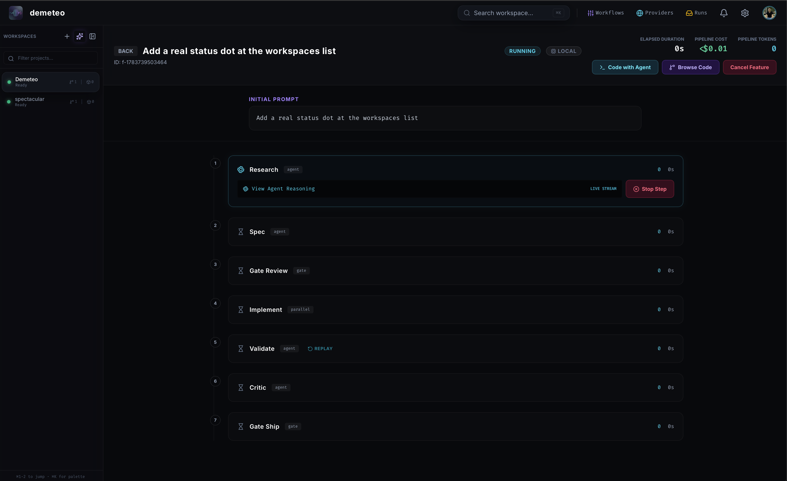

# Workflows

A **Workflow** is a reusable, versioned DAG of Steps. Demeteo ships nine **starter workflows** — every new workspace can run any of them, and you can edit copies in **Project Settings** for your own conventions.

The workflow catalog lives at `src-tauri/workflows/*.json` and is compiled into the binary; see [`docs/ARCHITECTURE.md`](https://github.com/stevenyepes/demeteo/blob/master/docs/ARCHITECTURE.md) for the schema.

## The starters

| Workflow | When to use it |
|----------|---------------|
| **Standard Feature Pipeline** | Default. Moderate-to-high complexity features: research, ticket decomposition, spec, gated implementation, validation, critic, gated merge. |
| **Bugfix Pipeline** | Isolated, well-scoped bugs. Reproduce → confirm root cause → fix → smoke test → regression → review. |
| **CI Fix Pipeline** | Red CI from test failures, lint errors, or build regressions. Diagnose → confirm → fix → verify → review. |
| **Documentation Update** | API docs, READMEs, guides, inline comments. Survey → scope → draft → validate links → review → polish. |
| **Experiment & Prototype** | Spikes and proof-of-concept work. Hypothesis → approve → build → evaluate → decide keep-or-discard → harden/archive. |
| **Refactor Pipeline** | Behaviour-preserving refactors. Baseline → plan → approve → sequential execute → regression → public-API drift review → review diff. |
| **Simple Task Pipeline** | Well-scoped, straightforward tasks. Plan → implement → validate. No gates. |
| **Code Review** | Review a branch or pull request with the harness's own review method and write a report; then run the project's gates on that branch. Nothing is committed or published. |
| **Address Review** | Work through the findings of a review that already happened, on the branch that was reviewed, and open a pull request. Every finding is closed by a change or answered in writing. |

## Anatomy of a step

Every step declares:

- A **kind**: `agent` (run a coding agent in a worktree), `sequence` (execute an ordered ticket list, one fresh agent per ticket; `parallel` is its accepted legacy alias), or `gate` (pause for human approval).
- A **prompt template** — the instructions the orchestrator renders for the agent, with placeholders like `{{feature_description}}`, `{{project_conventions}}`, and step-artifact references.
- An **artifact contract** — files the agent must produce (e.g. `artifacts/research-report.md`). The orchestrator captures them and attaches them to the next step's prompt.
- **Failure routing** — `on_failure: <step-id>` declares which step to bounce to when this one fails.
- **Max iterations** — how many times the orchestrator will retry before giving up.

`gate` steps have no prompt template or artifact contract. They are a structured pause that surfaces three actions to the human: **Approve**, **Redirect** (with feedback that re-enters the prior step), or **Cancel**.

## What every agent prompt carries

The template is only the middle of what an agent reads. The orchestrator wraps it, in this order, so that a template stored long ago still gets the current engine contract:

- An **Operating Boundary** naming what the step's capability may not do (write outside `artifacts/`, run a shell, reach the network), mirrored by a real filesystem fence.
- A **conduct block**: the turn is unattended, so a reply that ends on a plan or a question has done nothing; claims in the report are audited against tool results from the session; an implement turn holds the task's scope and reports anything else as a follow-up.
- The **artifact contract** — the files the step is expected to produce and where.
- For a verifying step, the **Harness Results** the orchestrator already captured and the **verdict** menu (`pass`, `fail`, `environment`, `evidence`). A verifier's `when_nothing_ran` field says whether an absent harness is terminal (the default) or a pass for a step that judges nothing the project must configure.

Prompts state goals, contracts and the reasons for constraints rather than step-by-step methods: current models plan better than a hand-written script, and read pressure language literally.

## The Standard Feature Pipeline

The default workflow — and the one in the screenshot below — has eight steps:

| # | Step | Kind | What it does |
|---|------|------|--------------|
| 1 | **Research Codebase** | `agent` | A senior-architect pass: every file likely to change, the patterns the implementation must follow, a risk register, and any external dependencies. Output: `artifacts/research-report.md`. |
| 2 | **Draft Implementation Spec** | `agent` | Turns the research report into a binding spec — acceptance criteria tagged by how each is proved (`[code]`, `[harness]`, `[process]`), data model changes, files to modify, public API changes, testing strategy, constraints, open questions. Output: `artifacts/implementation-spec.md`. |
| 3 | **Decompose Into Tickets** | `agent` | Breaks the spec's acceptance criteria into an ordered list of tickets sized for one agent session each — vertical slices with their own acceptance criteria, test command, and explicit `blocked_by` dependencies. There is no upper limit on the ticket count; the sizing rules decide. Output: `artifacts/task-list.json`. On a rework cycle the same step emits a delta: one ticket per defect the reviewer named. |
| 4 | **Review Tickets & Spec** | `gate` | **You** read the ticket list and the spec and either approve (implementation starts), redirect (your feedback re-enters step 2 or 3), or cancel. This is the moment to fix a bad decomposition — before any code is written. |
| 5 | **Implement Tickets** | `sequence` | Executes the approved ticket list strictly in order: each ticket gets a fresh agent session in the same worktree, sees the spec, the research report, and the record of already-committed tickets — including the `## Handoff` note each earlier ticket's agent left for whoever runs next — and is committed by the orchestrator before the next starts. A later validation failure re-runs only the implicated tickets and their dependents. |
| 6 | **Validate, Test & Security Scan** | `agent` | A QA pass that interprets the project's test harness output (already executed by the orchestrator), checks each acceptance criterion, scans for hardcoded secrets / TODOs / unhandled errors, and emits an overall **READY TO SHIP / BLOCKED** verdict. |
| 7 | **Critic Review** | `agent` | An adversarial review across correctness, spec compliance, security, performance, test coverage, and code quality. Emits **Critical / Major / Minor** issues and a final **PASS / PASS_WITH_NOTES / FAIL** verdict. |
| 8 | **Approve Merge / Publish** | `gate` *(dangerous)* | **You** review the validation and critic reports and approve to merge and open an MR, redirect (re-opens a prior step with feedback), or cancel. Marked *dangerous* because this step pushes to your remote. |

The orchestrator handles all transitions: when step 1 finishes, it renders step 2's prompt with the research artifact attached; once the gate approves, it walks the ticket list one agent at a time; and so on. You intervene only at the two `gate` steps.

## Running a non-default workflow

When you click **Launch feature**, the workflow dropdown in the Start a feature modal pre-selects your workspace's default (Standard for new workspaces). Switch to any other starter per-feature — for example, *Bugfix Pipeline* for an isolated regression, *Refactor Pipeline* for a behaviour-preserving change, *Simple Task* for a one-line fix.
## Definition schema

Workflow definitions are data with a versioned, machine-checkable schema.
The upcoming **schema v2** (nodes + edges — a true DAG) is published as JSON
Schema at [`workflow-schema-v2.json`](workflow-schema-v2.json); it is
generated from the engine's own types, so it can never drift from the code.
Today's stored definitions are schema v1 (the ordered step list described
above); v1 documents auto-migrate to v2 mechanically — list order becomes a
chain of edges, `on_failure` becomes a declarative retry policy, and
`task_list_from` becomes a typed edge.
