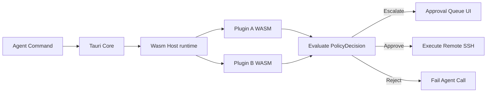

# Architectural Blueprint: Hexagonal (Ports & Adapters) Structure  *(LEGACY — superseded)*

> **This document is legacy.** It describes the v1 single-agent chat-style
> supervisor. The active plan is the multi-agent orchestrator; see
> [`docs/REDESIGN_ARCHITECTURE.md`](REDESIGN_ARCHITECTURE.md) and
> [`REDESIGN_PLAN.md`](../REDESIGN_PLAN.md). This file is preserved for
> historical context. The `AcpRuntime` spec that lived here is the only
> portion that survived the pivot; it has moved to
> [`AGENT_INTEGRATION.md`](../AGENT_INTEGRATION.md).

---

This document details the software architecture of **Demeteo** using the **Hexagonal Architecture (Ports & Adapters)** pattern. This design guarantees loose coupling, high testability, and a clear path for future plugin extensibility.

For the **agent integration spec** (runtime trait, per-turn channels, scope fence, install flow, error model, working memory, phase plan), see **[AGENT_INTEGRATION.md](file:///home/jsteven/Projects/demeteo/AGENT_INTEGRATION.md)** — that document is the source of truth for v1 agent wiring; this one covers the structural backbone that surrounds it.

---

## 📐 The Hexagon: Ports & Adapters Design

Demeteo's core responsibilities are decoupled from external frameworks (Tauri, SQLite, SSH networking libraries). The application is structured into the **Core Domain**, **Ports (interfaces)**, and **Adapters (implementations)**.

```
                  +-------------------------------------------------------+
                  |                     ADAPTERS (Driven)                 |
                  |                                                       |
                  |   +-----------------------------------------------+   |
                  |   |                SQLite DB Adapter              |   |
                  |   +-----------------------+-----------------------+   |
                  |                           |                           |
                  +---------------------------|---------------------------+
                                              | (implements)
                                              v
+-----------------+       +-----------------------------------------------+       +------------------+
| ADAPTERS (Driver|       |                 PORTS (Driven)                |       | ADAPTERS (Driven)|
|                 |       |                                               |       |                  |
| +-------------+ |       |  +-----------------------------------------+  |       |  +-------------+ |
| |  Tauri IPC  | |=====> |  |              DatabasePort               |  |       |  |  SshClient  | |
| +-------------+ |(calls)|  +-----------------------------------------+  |       |  |  SFTP       | |
|                 |       |                                               |       |  +------+------+ |
| +-------------+ |       |  +-----------------------------------------+  |       |         ^        |
| |   Agent     | |=====> |  |           AgentRuntime / Transport      |  |====== | (implements)|
| |  Frontend   | |(calls)|  +-----------------------------------------+  |       |                  |
| |  (per-turn  | |       |                                               |       |  +-------------+ |
| |   channels) | |       |  +-----------------------------------------+  |       |  | Local Subpro| |
| +-------------+ |       |  |       AgentExecutionPort (decorator)    |  |       |  |  + SSH Chan  | |
|                 |       |  +-----------------------------------------+  |       |  +-------------+ |
+-----------------+       +-----------------------^-----------------------+
                                                |
                                                | (notifies)
                                                |
                  +-------------------------------|-----------------------+
                  |                  CORE DOMAIN (Hexagon)                |
                  |                                                       |
                  |   +-----------------------------------------------+   |
                  |   |  - Policy Engine (incl. scope pre-rule)       |   |
                  |   |  - Thread Coordinator (Worktree isolation)   |   |
                  |   |  - Session State Machine (SSH channels)       |   |
                  |   |  - AgentEvent vocabulary (text/tool/plan/...)  |   |
                  |   +-----------------------------------------------+   |
                  |                                                       |
                  +-------------------------------------------------------+
```

---

## 📁 Recommended Directory Structure

The Rust project under `src-tauri/src` is partitioned as follows. **Bold entries are new in v1**; everything else exists or was sketched in earlier phases.

```text
src-tauri/src/
├── main.rs                          # CLI entry point
├── lib.rs                           # Tauri entry point & DI wire-up
├── domain/                          # Core Domain (no Tauri/russh dependencies)
│   ├── mod.rs
│   ├── models.rs                    # Machine, Session, CommandEvent, PolicyRule
│   ├── policy.rs                    # AgentAction, PolicyDecision, PolicyRule
│   ├── policy_engine.rs             # Glob + bash-prefix matching, scope pre-rule
│   ├── intercept.rs                 # InterceptPayload, ExecutionResult, Resolution
│   └── agent_event.rs               # NEW: AgentEvent enum (text/tool/plan/usage/...)
├── ports/                           # Inbound and Outbound Interfaces (Traits)
│   ├── mod.rs
│   ├── db.rs                        # DatabasePort (machines, profiles, threads, rules, working_memory)
│   ├── execution.rs                 # ExecutionPort (SFTP, run_command, worktree, spawn_interactive)
│   ├── notification.rs              # NotificationPort (emit_permission_requested, emit_command_executed)
│   ├── agent_execution.rs           # AgentExecutionPort (the existing submit/approve/reject decorator target)
│   └── agent_runtime.rs             # NEW: AgentRuntime + AgentTransport + AgentSession
├── adapters/                        # Implementations of Ports
│   ├── mod.rs
│   ├── database/
│   │   ├── mod.rs
│   │   └── sqlite.rs                # SQLite-backed DatabasePort (adds working_memory methods)
│   ├── ssh/
│   │   ├── mod.rs
│   │   └── client.rs                # ExecutionPort over SSH; adds spawn_interactive for agent channel
│   ├── local/                       # NEW: Local-subprocess + local-FS implementations
│   │   ├── mod.rs
│   │   ├── fs.rs                    # ExecutionPort for auth_type=local
│   │   └── pty.rs                   # (existing) local PTY
│   ├── tauri_ui/
│   │   ├── mod.rs
│   │   ├── commands.rs
│   │   └── events.rs
│   └── agent/                       # NEW: agent runtimes, one per AgentKind
│       ├── mod.rs
│       ├── registry.rs              # AgentRegistry: spawn(name, config) -> Box<dyn AgentSession>
│       ├── policy_decorator.rs      # (existing) PolicyEnforcedExecutionPort stays unchanged
│       ├── acp/                     # NEW: ACP stdio adapter
│       │   ├── mod.rs
│       │   ├── runtime.rs           # AcpRuntime: wires ACP transport -> AgentEvent stream
│       │   ├── event_mapper.rs      # ACP session/update + tool_call -> AgentEvent
│       │   ├── tool_bridge.rs       # ACP fs/* + terminal/* client methods -> ExecutionPort
│       │   └── install.rs           # Official-script install per agent
│       ├── opencode/                # NEW: same AcpRuntime, config = `opencode acp` binary
│       │   └── mod.rs               # (thin: just the AgentConfig + availability check)
│       └── hermes/                  # NEW: same AcpRuntime, config = `hermes acp` binary
│           └── mod.rs
└── plugins/                         # Future: WASM plugin host
    ├── mod.rs
    ├── trait.rs
    └── wasm_host.rs
```

On the frontend:

```text
src/
├── main.tsx
├── App.tsx                          # +useAgentSession hook; sendDirective -> invoke('agent_prompt')
├── App.css
├── types.ts                         # +AgentEvent, AgentKind, AgentConfig, AgentSession
├── sessionRegistry.ts               # (existing) terminal session registry
├── agentSessionRegistry.ts          # NEW: per-thread agent session state
└── components/
    ├── NewThreadModal.tsx           # +agent selection card; auto-default; blocks if none enabled
    ├── EnvModal.tsx                 # agents[] becomes structured {kind, enabled}[]
    ├── SupervisorPlane.tsx          # +Stop button, +auto-inspector trigger, +agent_error events
    ├── CodeInspector.tsx
    ├── PolicyEditor.tsx
    ├── Sidebar.tsx                  # +working memory section wired to DB-backed state
    ├── TerminalTabs.tsx
    ├── SSHTerminal.tsx
    └── ...
```

---

## 🔌 Extensibility: Two Layers

Demeteo has two extension axes and they are independent. Both follow the same pattern (trait + registry + decorator-friendly composition), but they target different concerns.

### Layer 1 — Agent runtimes (`ports/agent_runtime.rs`)

Allows new coding agents to be plugged in by adding a new entry under `adapters/agent/`. The `AgentRuntime` trait is transport-neutral: the `AcpRuntime` (v1) implements it via stdio JSON-RPC; future runtimes (HTTP, MCP, a Demeteo-internal Rust agent) implement the same trait with a different transport. The dispatcher, policy decorator, UI, and channels are all unaware of which runtime is in use. **See AGENT_INTEGRATION.md for the full spec.**

### Layer 2 — Policy / approval plugins (existing WASM design)

For custom approval strategies, telemetry integrations, or any cross-cutting concern that wants to inspect every `AgentAction` *before* the policy decorator decides. Compiles to WASM, loaded from `~/.config/demeteo/plugins/`, evaluated inside a `wasmtime` sandbox. This is the original extensibility layer described in the next section and remains the long-term home for third-party policy logic.

---

## 🔌 Original Plugin Host (WASM)

> **Status:** Designed but not yet implemented. The v1 agent integration does not require WASM plugins — the scope fence, policy rules, and `PolicyEnforcedExecutionPort` cover v1's needs. WASM plugins become valuable when third parties want to ship custom approval logic without rebuilding Demeteo.

### 1. The Plugin Interface (Rust Trait)

All plugins compile to WASM targets and implement a normalized set of functions:

```rust
// src-tauri/src/plugins/trait.rs

pub struct PluginContext {
    pub machine_id: String,
    pub work_directory: String,
}

pub enum PolicyDecision {
    Approve,
    Reject { reason: String },
    EscalateToUser,
}

pub trait DemeteoPlugin {
    /// Unique identifier for the plugin
    fn name(&self) -> &str;

    /// Evaluates if a given tool-call or shell command needs human validation
    fn evaluate_command(
        &self,
        ctx: &PluginContext,
        command: &str
    ) -> PolicyDecision;

    /// Intercepts SFTP write payloads (can inspect/modify code updates before write)
    fn intercept_file_write(
        &self,
        ctx: &PluginContext,
        file_path: &str,
        content: &[u8]
    ) -> PolicyDecision;
}
```

### 2. WASM Sandbox Engine (`wasmtime` integration)

WASM plugins execute in a sandbox with restricted resources. They cannot access the local filesystem or make unauthorized HTTP requests directly, guaranteeing that the Supervisor dashboard remains secure.



---

## 🔗 Port Specifications (Traits)

The ports are stable interfaces. Adapters are swappable implementations. v1 keeps the existing `DatabasePort`, `ExecutionPort`, `NotificationPort`, and `AgentExecutionPort` largely as-is and adds two new ports (`AgentRuntime`, `AgentTransport`) for the agent-integration work described in AGENT_INTEGRATION.md.

### 1. Database Port (`ports/db.rs`)

Defines how configuration states, credentials, active sessions, logs, and **per-thread working memory** are persisted.

```rust
pub trait DatabasePort: Send + Sync {
    // Machines & profiles
    fn get_machines(&self) -> Result<Vec<Machine>, String>;
    fn add_machine(&self, machine: Machine) -> Result<(), String>;
    fn delete_machine(&self, id: &str) -> Result<(), String>;
    fn update_machine(&self, machine: Machine) -> Result<(), String>;
    fn get_agent_profiles(&self, machine_id: &str) -> Result<Vec<AgentProfile>, String>;
    fn add_agent_profile(&self, profile: AgentProfile) -> Result<(), String>;
    fn delete_agent_profile(&self, id: &str) -> Result<(), String>;

    // Chat & history (vestigial; see AGENT_INTEGRATION.md for the v1 stance)
    fn create_chat_session(&self, id: &str, agent_id: &str, title: &str) -> Result<(), String>;
    fn get_chat_sessions(&self, agent_id: &str) -> Result<Vec<ChatSession>, String>;
    fn add_chat_message(&self, id: &str, session_id: &str, sender: &str, content: &str) -> Result<(), String>;
    fn get_chat_messages(&self, session_id: &str) -> Result<Vec<ChatMessage>, String>;
    fn add_session_history(&self, id: &str, machine_id: &str, session_type: &str, title: &str, content: Option<&str>) -> Result<(), String>;
    fn get_session_history(&self, machine_id: &str) -> Result<Vec<SessionHistory>, String>;

    // Thread sessions
    fn get_thread_sessions(&self, machine_id: &str) -> Result<Vec<ThreadSession>, String>;
    fn add_thread_session(&self, thread: ThreadSession) -> Result<(), String>;
    fn update_thread_status(&self, id: &str, status: &str) -> Result<(), String>;
    fn delete_thread_session(&self, id: &str) -> Result<(), String>;

    // Policy rules
    fn get_policy_rules(&self, machine_id: &str) -> Result<Vec<PolicyRule>, String>;
    fn add_policy_rule(&self, rule: PolicyRule) -> Result<(), String>;
    fn update_policy_rule(&self, rule: PolicyRule) -> Result<(), String>;
    fn delete_policy_rule(&self, id: &str) -> Result<(), String>;

    // Working memory (NEW in v1 — see AGENT_INTEGRATION.md §Working Memory)
    fn upsert_working_memory_entry(&self, thread_id: &str, entry: WorkingMemoryEntry) -> Result<(), String>;
    fn get_working_memory(&self, thread_id: &str) -> Result<Vec<WorkingMemoryEntry>, String>;
    fn clear_working_memory(&self, thread_id: &str) -> Result<(), String>;
}
```

### 2. Remote Execution Port (`ports/execution.rs`)

Defines network boundaries. Concrete implementations (SSH vs Local) are injected dynamically based on the target machine's `auth_type`. v1 adds `spawn_interactive` to support long-lived agent process channels over SSH.

```rust
pub trait ExecutionPort: Send + Sync {
    /// One-shot TCP+SSH handshake for the UI's "Test Connection" button
    fn test_connection(&self, machine_id: &str) -> Result<(), String>;
    fn run_command(&self, machine_id: &str, cmd: &str) -> Result<String, String>;
    fn read_file(&self, machine_id: &str, path: &str) -> Result<String, String>;
    fn write_file(&self, machine_id: &str, path: &str, content: &str) -> Result<(), String>;
    fn get_metadata(&self, machine_id: &str, path: &str) -> Result<SftpEntry, String>;
    fn list_dir(&self, machine_id: &str, path: &str) -> Result<Vec<SftpEntry>, String>;
    fn setup_worktree(&self, machine_id: &str, repo_path: &str, branch: &str, sandbox_path: &str) -> Result<(), String>;

    // NEW in v1 — long-lived process channel for remote agent processes
    fn spawn_interactive(
        &self,
        machine_id: &str,
        cmd: &str,
        env: &HashMap<String, String>,
        cwd: &str,
    ) -> Result<Box<dyn InteractiveHandle>, String>;
}

pub trait InteractiveHandle: Send {
    fn stdin(&mut self) -> &mut dyn Write;
    fn stdout(&mut self) -> &mut dyn Read;
    fn kill(&mut self) -> Result<(), String>;
    fn try_wait(&mut self) -> Result<Option<i32>, String>; // None = still running
}
```

The `InteractiveHandle` is what makes "agent runs on the remote host" possible without giving up the byte-stream abstraction. Local agent spawns are wrapped to the same trait using `tokio::process::Child`'s stdio.

### 3. Agent Runtime Port (`ports/agent_runtime.rs` — NEW in v1)

The full spec is in `AGENT_INTEGRATION.md`. Brief sketch:

```rust
pub trait AgentRuntime: Send + Sync {
    fn kind(&self) -> &'static str; // "acp" (v1); future: "http", "mcp", ...

    /// Spawn the agent subprocess / open the channel, return a session handle
    fn start(&self, ctx: AgentContext) -> Result<Box<dyn AgentSession>, String>;

    /// Check if the binary is on PATH (used by install-if-missing flow)
    fn is_available(&self) -> bool;

    /// The official install script for this agent (shown verbatim in the consent prompt)
    fn install_command(&self) -> &'static str;
}

pub trait AgentSession: Send {
    fn session_id(&self) -> &str;
    fn prompt(&self, text: &str) -> Result<AgentEventStream, String>;
    fn cancel(&self) -> Result<(), String>; // idempotent
}

pub struct AgentEventStream {
    pub inner: Pin<Box<dyn Stream<Item = AgentEvent> + Send>>,
}
```

### 4. Agent Execution Port (`ports/agent_execution.rs`)

Unchanged from the existing implementation. The `PolicyEnforcedExecutionPort` (`adapters/agent/policy_decorator.rs`) wraps an `AgentExecutionPort` and remains the chokepoint where user actions get policy-checked. v1 extends `InterceptPayload` with an optional `tool_call_id: Option<String>` so the ACP bridge can correlate tool results back to the originating agent tool call.

### 5. Notification Port (`ports/notification.rs`)

Unchanged. Continues to emit `permission_requested` and `command_executed` as global Tauri events. v1 adds one more event (`thread_status_changed`) so the backend can correct the frontend's optimistic status, but the trait surface itself is stable.

---

## 🔀 Step-by-Step Implementation Sequence

> **Updated for v1 agent integration.** Items 1–4 are the existing structural setup. Items 5–8 are the new agent-integration phases. See AGENT_INTEGRATION.md for the detailed phase plan with verification checkpoints.

1. **Decouple Core Logic** *(largely done in earlier phases)*: structural SQLite code lives behind `DatabasePort`; SFTP and SSH live behind `ExecutionPort`. The new `thread_working_memory` table and the new `spawn_interactive` method extend these ports without disturbing existing adapters.
2. **Implement Adapters**:
   * `SqliteAdapter` already exists; extend it with the three new `working_memory` methods.
   * `SshClientAdapter` already exists; add `spawn_interactive` using `ssh2::Channel::exec()` with persistent stdin/stdout.
   * **NEW** `LocalSubprocessAdapter` under `adapters/local/` for `auth_type=local` execution and `spawn_interactive` (wraps `tokio::process::Command`).
3. **Register dependency injections** in `lib.rs`. Existing DI for `DatabaseState`, `ExecutionState`, `AgentExecutionState`, `NotificationState` stays. v1 adds `AgentRuntimeState { registry: Arc<AgentRegistry> }` constructed in the `setup` block.
4. **WASM Plugin Host Setup** *(deferred)*: Pull in `wasmtime` and load WASM plugins from `~/.config/demeteo/plugins/`. Not required for v1; the policy decorator and scope fence cover all v1 approval needs.
5. **Phase 7a — Port + domain skeleton**: add `AgentRuntime`, `AgentTransport`, `AgentEvent` to `ports/` and `domain/`. Add the SQLite migration for `thread_working_memory`. No UI changes yet.
6. **Phase 7b — AcpRuntime**: implement the ACP stdio adapter. Wire `acp_agent_client_protocol` crate (or hand-rolled JSON-RPC if we want to defer the dependency). Map `session/update` and `tool_call` to `AgentEvent`. Implement the `fs/*` and `terminal/*` client methods by delegating to `PolicyEnforcedExecutionPort`.
7. **Phase 7c — UI wire-up**: add Tauri commands `agent_start`, `agent_prompt`, `agent_cancel`, `agent_restart`. Update `NewThreadModal` with the agent selection card. Update `App.tsx` so `sendDirective` actually invokes the agent pipeline. Render `ToolCall`, `ToolCallUpdate`, `Plan`, `Usage`, `Error` events.
8. **Phase 7d — Per-agent settings**: extend `Machine.agents` to structured `AgentConfig` with model, API key reference, working-dir override. Build the per-agent config UI in `EnvModal`. Add the structured `agent_kind` field to `ThreadSession`.
9. **Phase 7e — Second transport** *(optional, after v1 ships)*: add a non-ACP runtime (HTTP/Server transport for the next agent that doesn't speak ACP) to prove the runtime port is genuinely transport-neutral.
