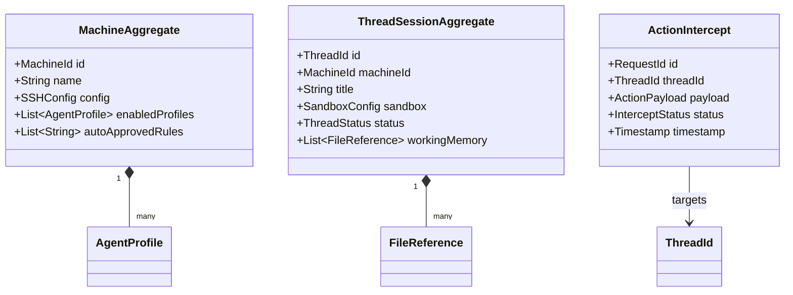

# Domain-Driven Design (DDD) & Ubiquitous Language  *(LEGACY — superseded)*

> **This document is legacy.** It describes the bounded contexts for the
> v1 single-agent chat-style supervisor (Thread, Machine, AgentProfile,
> etc.). The active plan is the multi-agent orchestrator; see
> [`docs/REDESIGN_DDD_MODEL.md`](REDESIGN_DDD_MODEL.md) and
> [`REDESIGN_PLAN.md`](../REDESIGN_PLAN.md). This file is preserved for
> historical context.

---

This document establishes the **Ubiquitous Language**, **Bounded Contexts**, and **Domain Model** for Demeteo. It acts as the single source of truth for architectural terminology, ensuring alignment between product definitions, frontend UI states, and backend Rust structs.

---

## 🗣️ Ubiquitous Language

To prevent confusion between system protocols, AI integrations, and infrastructure controls, all developers must adhere to the following terminology:

### 1. Actor & User Interface Terms
* **Supervisor**: The human developer running Demeteo who oversees, reviews, and approves/rejects the actions of autonomous AI agents.
* **Directive**: A text instruction or feedback payload sent by the **Supervisor** to guide or correct the **Agent**.
* **Supervisor Plane (Dashboard)**: The unified user interface showing the telemetry stream, active files, logs, and action interception queue.
* **Code Inspector**: The split-pane editor component used to read file contents surrounding a proposed code modification.

### 2. Environment & Execution Terms
* **Target Environment (Machine)**: A remote VM/Server (via SSH) or local developer node where commands are executed.
* **Sandbox**: An isolated filesystem area on a **Target Environment** designated for agent execution.
* **Project Mode (Worktree Sandbox)**: An isolated development workspace created using a dedicated Git Worktree and branch (e.g. `.demeteo/worktrees/feature-branch`).
* **Ad-Hoc Mode (Raw Session)**: Direct workspace access in a specified directory without version control isolation, secured strictly by permission checks.
* **Thread Session (Active Thread)**: A contextually isolated task loop binding an agent to a specific **Target Environment** and **Sandbox**.

### 3. Policy & Gatekeeping Terms
* **Permission Proxy**: The security gateway that intercepts structural or mutating agent requests.
* **Auto-Approval Rules**: User-defined regex patterns and commands stored in the database that are automatically allowed to execute without prompting the Supervisor (e.g. read-only commands).
* **Action Intercept**: A mutating command or file edit request that is suspended by the **Permission Proxy** waiting for human evaluation.
* **Approval Queue**: The active list of **Action Intercepts** waiting in the UI for the Supervisor to Approve, Reject, or Modify.
* **Working Memory**: The set of files actively registered by the agent as part of its working workspace.

---

## 🗺️ Bounded Contexts

Demeteo is partitioned into four distinct bounded contexts:

```mermaid
grid-layout
[Target Control Context]     --> [Policy Decision Context]
[Agent Adapter Context]      --> [Policy Decision Context]
[Policy Decision Context]    --> [Supervisor Dashboard Context]
```

### 1. Target Control Context
Responsible for network transport, SSH/SFTP tunnels, local process spawning (PTYs), and sandbox isolation directory setups (Git worktrees).
* *Key Interfaces*: `ExecutionPort`

### 2. Agent Adapter Context
Translates external agent communication protocols (Model Context Protocol, OpenHands Websockets, REST APIs) into a unified domain event loop.
* *Key Interfaces*: `AgentGatewayPort`

### 3. Policy Decision Context (Permission Proxy)
Validates whether incoming agent events are safe to run, evaluating them against auto-approval rules and managing blocked execution handles.
* *Key Interfaces*: `PolicyEngine`, `PermissionQueue`

### 4. Supervisor Dashboard Context (UI)
Renders active states, stream logs, terminal sessions, code diffs, and manages the Supervisor approval input streams.
* *Key Interfaces*: `NotificationPort`

---

## 📦 Core Aggregates & Entities



### 1. Machine Aggregate
* **Root Entity**: `Machine` (ID, Name, connection settings, enabled agents list, and customizable auto-approval list).
* **Value Object**: `SSHConfig` (Host, port, username, system keyring reference).
* **Value Object**: `AgentProfile` (Name, protocol type, startup directory, tunnel port).

### 2. Thread Session Aggregate
* **Root Entity**: `ThreadSession` (ID, Machine ID, Title, Status, Working Memory).
* **Value Object**: `SandboxConfig` (Mode: `Worktree` | `AdHoc`, path, git branch).
* **Value Object**: `FileReference` (File path, lines count, isNew status).

### 3. Action Intercept Aggregate
* **Root Entity**: `ActionIntercept` (ID, Thread ID, Type, Payload, Status, Timestamp).
* **Value Object**: `ActionPayload` (Shell command string OR Diff details showing file alterations).
