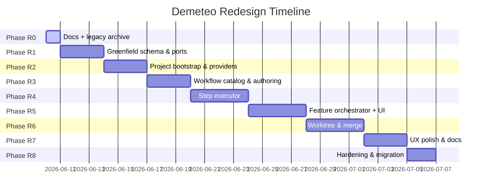

# Demeteo Redesign: Execution & Verification Plan

> **Phase-by-phase implementation plan with verification checkpoints.**
> See [`REDESIGN_PLAN.md`](../REDESIGN_PLAN.md) §4 for the high-level phase
> summary and §1 for the decision table that drives each phase's scope.

Each phase has a "Done means…" statement. Phases are sequential; don't start the next until the current is verified.

---

## Phase R0 — Domain & docs

**Scope:** Establish the redesign docs as the source of truth. Archive legacy docs. No code changes.

**Tasks:**

- [x] Create `REDESIGN_PLAN.md` (master plan).
- [x] Create `docs/REDESIGN_DDD_MODEL.md` (bounded contexts).
- [x] Create `docs/REDESIGN_ARCHITECTURE.md` (hexagon, ports, layout).
- [x] Create `docs/REDESIGN_EXECUTION_PLAN.md` (this file).
- [x] Create `docs/REDESIGN_DECISIONS.md` (the 33-decision table as a standalone reference).
- [x] Create `docs/REDESIGN_OPEN_QUESTIONS.md` (deferred items, captured for future).
- [ ] Update `AGENTS.md` to reference the new docs and add the pivot summary.
- [ ] Rewrite `AGENT_INTEGRATION.md` to replace the `AcpRuntime` spec with the `CliRuntime` spec (one-shot CLI + JSON-lines, no ACP, no JSON-RPC, `OPENCODE_PERMISSION` env var).
- [ ] Archive `ARCHITECTURE.md`, `DDD_MODEL.md`, `EXECUTION_PLAN.md` as `docs/LEGACY_*.md`.

**Done means:** All six new docs exist; `AGENTS.md` and `AGENT_INTEGRATION.md` are updated; the three legacy docs are archived (not deleted); the 33-decision table is the single source of truth and is referenced from every other doc.

**Verification:**

```bash
# All new docs exist
ls REDESIGN_PLAN.md docs/REDESIGN_*.md
# Legacy docs are archived, not deleted
ls docs/LEGACY_*.md
# AGENTS.md mentions the new plan
grep -c "REDESIGN_PLAN" AGENTS.md
# The 33 decisions are in the decisions doc
grep -c "^| [0-9]" docs/REDESIGN_DECISIONS.md  # should print 33 (table rows)
```

---

## Phase R1 — Greenfield schema & ports (Rust)

**Scope:** Add the new tables to SQLite. Add the new ports. No UI changes. No agent spawns.

**Tasks:**

- [ ] New `db.rs` migrations: `projects`, `repositories`, `provider_instances`, `workflows`, `workflow_versions`, `features`, `feature_runs`, `step_executions`, `gate_decisions`, `subtask_runs`, `subtask_merges`, `project_settings`, `app_settings`.
- [ ] New ports: `WorkflowRepository`, `ProjectRepository`, `ProviderInstanceRepository`, `FeatureOrchestrator`, `StepExecutor`, `WorktreeManager`, `MergeExecutor`, `MrPublisher`, `ConflictResolver`, `ArtifactStore`, `PricingTable`, `UiStateRepository`, `DiskUsageCalculator`, `DocsRepository`.
- [ ] Adapters: `SqliteWorkflowRepository`, `SqliteProjectRepository`, `SqliteProviderInstanceRepository`, `SqliteFeatureOrchestrator`, `DagStepExecutor`, `SqliteArtifactStore`, `HardcodedPricingTable`, `BundledDocsRepository`, `FsDiskUsageCalculator`.
- [ ] Domain models: `Project`, `Repository`, `ProviderInstance`, `Workflow`, `WorkflowVersion`, `Feature`, `FeatureRun`, `StepExecution`, `GateDecision`, `SubtaskRun`, `SubtaskMerge`, `WorktreeStrategy`, `ConflictReport`, `MergeStrategy`, `Cost`, `Duration`.
- [ ] Per-table CRUD tests with an in-memory SQLite fixture.
- [ ] Per-port contract tests (the trait's invariants, exercised against the SQLite adapter).

**Done means:**

- `cargo build --manifest-path src-tauri/Cargo.toml` passes.
- `cargo test` passes; new tests cover CRUD for all new tables and contracts for all new ports.
- The legacy `thread_sessions` table is preserved in the schema (for migration safety) but no port surfaces it; the row is created as empty.
- The `PricingTable` is hard-coded with the 5–10 most common models (Claude Sonnet/Opus/Haiku, GPT-4o/o1/o3-mini, Gemini Pro, Llama via Ollama at $0). Editable from Preferences in a later phase.

**Verification:**

```bash
cargo build --manifest-path src-tauri/Cargo.toml
cargo test --manifest-path src-tauri/Cargo.toml --lib
# Open the SQLite DB and confirm new tables exist
sqlite3 ~/.local/share/com.demeteo.app/demeteo.db ".tables"
# Should show: projects, repositories, provider_instances, workflows, workflow_versions, features, feature_runs, step_executions, gate_decisions, subtask_runs, subtask_merges, project_settings, app_settings, schema_version, ... (legacy tables also present for migration safety)
```

---

## Phase R2 — Project bootstrap & provider wiring (Rust + minimal UI)

**Scope:** Create projects, connect providers, clone repos, run bootstrap detection, propose worktree strategy.

**Tasks:**

- [ ] `ProviderInstance.connect` calls `/user` on GitHub, `/api/v4/user` on GitLab; stores encrypted PAT.
- [ ] `Project.create` accepts a list of repo URLs, derives the provider instance, kicks off clone jobs.
- [ ] `GitWorkflowDetector` runs at clone: reads default branch, PR template, CI config, branch protection signals. Stores findings in `project_settings`.
- [ ] `WorktreeStrategyDetector` proposes a strategy (default branch, branch prefix, default test command, PR template body). UI shows the proposal; user approves/edits.
- [ ] UI: `ProjectSettings` page with "Provider", "Repositories", "Worktree strategy" sections.
- [ ] UI: `ProviderSettings` page in Preferences (Q17a extended for multi-instance).
- [ ] UI: minimal `ProjectHome` skeleton with just the "Project settings" button (the full Q21-B view comes in R7).

**Done means:**

- A user can: open Preferences → Connect GitHub → paste PAT → see "Connected as `<name>`" → create a project with name + repo URLs → repos are cloned → bootstrap detection runs → the user sees the proposed worktree strategy → approves → the project's `worktree_strategy` row is set.
- A user can connect multiple instances of the same kind (e.g., `gitlab.com` and `gitlab.mycorp.com`) and they're both listed by their display name + host.
- The `ProviderInstance.connect` fails cleanly on an invalid PAT with a typed error.

**Verification:**

```bash
# Create a test project with a public repo (use a real small OSS repo for the smoke test)
# Verify the clone succeeded on disk
ls ~/.local/share/demeteo/projects/<project_id>/repos/<repo_name>/
# Verify the bootstrap detection ran
sqlite3 ~/.local/share/com.demeteo.app/demeteo.db "SELECT * FROM project_settings WHERE project_id = '<id>';"
```

---

## Phase R3 — Workflow catalog & authoring (Rust + UI)

**Scope:** Author, version, export, import workflows. Ship the starter pack.

**Tasks:**

- [ ] `WorkflowRepository` + `WorkflowVersionRepository` fully wired.
- [ ] `WorkflowEditor` (form-based, v1.0): add/edit/remove/reorder steps; per-step config (tool, model, mode, prompt, artifact path, conditional edges, retry policy, artifact mode).
- [ ] `WorkflowList` page: starter pack + user workflows.
- [ ] `workflow_export` produces a JSON file; `workflow_import` reads a JSON file (creates a new Workflow + initial Version; preserves multiple versions if present).
- [ ] Starter pack bundled: `workflows/research-spec-plan-tasks-implement-validate.json` and 4 more (the user's example + common variations: bugfix, docs-update, refactor, experiment).
- [ ] First-launch seeding: starter pack workflows are inserted on first launch; user can edit (creates a new version) but not delete (UI offers "Revert to default" instead).

**Done means:**

- A user can: open Workflows → see 5 starter workflows → clone one to edit → add/remove/reorder steps → save as a new version → export the workflow to a JSON file → delete the local copy → re-import the JSON file → the workflow is back.
- A user can create a new workflow from scratch and run the editor end-to-end.
- The "Revert to default" affordance works on starter pack workflows (re-creates the original version).

**Verification:**

```bash
# Confirm the starter pack is bundled
ls src-tauri/workflows/  # 5 JSON files
# Create + export + import round-trip
# (manual: UI flow; automated: workflow_export + workflow_import test)
cargo test --manifest-path src-tauri/Cargo.toml --lib workflow
```

---

## Phase R4 — Step executor (Rust)

**Scope:** The small DAG engine. Three step types. Conditional edges. Per-step persistence.

**Tasks:**

- [ ] `StepExecutor` trait + `DagStepExecutor` impl.
- [ ] `agent` step: spawn `opencode run --format json --session <uuid> --dir <worktree> [--model <provider/model>] [--agent <name>] "<prompt>"`; stream nd-JSON events; drive to completion; capture output as artifact; emit `step_completed`.
- [ ] `parallel` step: spawn a planner agent session with a planning prompt; parse the structured output as a subtask DAG; fan out across available workers (each with its own `--session <uuid>`); collect structured results.
- [ ] `gate` step: emit `gate_required`; wait for `gate_decide`; resume.
- [ ] Conditional edges: `on_failure → goto <step>`, `on_all_success → continue`, `on_any_failure → goto <gate>`, `max_iterations: u32`.
- [ ] `StepExecutor` persists every state transition to `step_executions` (checkpoint on every state change).
- [ ] The `AgentRuntime`'s `CliRuntime` is called by the executor, not the UI. ACP is not used.

**Done means:**

- A 5-step workflow (research → spec → plan → tasks → implement-stub) runs end-to-end on a local project using `opencode run --format json` with per-step `--session` continuity.
- The `gate` step between plan and tasks actually pauses; the user clicks Approve; the executor resumes.
- A `parallel` step with 3 subtasks runs them; the executor collects all 3 results; emits `step_completed` with the structured result.
- A conditional edge (`on_failure → goto Fix`) loops correctly; `max_iterations: 3` stops the loop.
- Every state transition is in `step_executions`; killing and restarting demeteo resumes from the last completed step.
- The `AcpRuntime`, `jsonrpc.rs`, `event_mapper.rs`, `tool_bridge.rs`, `transport_local.rs`, and `transport_ssh.rs` files are deleted. `CliRuntime` (`cli_runtime.rs`) is the sole runtime implementation.

**Verification:**

```bash
# Run the 5-step test workflow
cargo test --manifest-path src-tauri/Cargo.toml --lib step_executor
# Manual: launch a feature on a real project, watch the steps complete
```

---

## Phase R5 — Feature orchestrator (Rust + UI)

**Scope:** The user-facing "Start a feature" flow. Per-feature lifecycle. Re-entry on launch.

**Tasks:**

- [ ] `FeatureOrchestrator` port + impl.
- [ ] `StartFeatureModal` (Q22-D): slim modal with description textarea + inferred chips (workflow, repos, conflicts).
- [ ] `Customize…` expansion to the full form (workflow picker, target repos, conflict policy, budget).
- [ ] `ProjectHome` (Q21-B): current feature + queue + lazy-loaded repo map.
- [ ] `FeatureDetail` (Q13): step timeline + gate UX + artifact list + telemetry.
- [ ] `gate_decide` wires into the `StepExecutor` resume path.
- [ ] Per-step checkpoint persistence (carried from R4; surfaced as a "Resume" affordance on launch).
- [ ] Synthetic gate on mid-step interrupt (Q15-B).
- [ ] Cost/duration telemetry: per-step `Cost` and `Duration` recorded in `step_executions`; surfaced in step timeline + feature header.

**Done means:**

- A user can: open a project → click "New feature" → describe a feature → click "Launch" → see the feature running in ProjectHome → click into FeatureDetail → see the step timeline + telemetry → reach a gate → make a decision → watch the next step run.
- Killing demeteo mid-feature and relaunching surfaces a synthetic gate; the user can resume or restart the interrupted step.
- A completed feature shows its cost and wall-clock in the feature header.

**Verification:**

```bash
# Run the orchestrator integration test
cargo test --manifest-path src-tauri/Cargo.toml --lib feature_orchestrator
# Manual: launch a feature, kill demeteo, relaunch, see the synthetic gate
```

---

## Phase R6 — Worktree & merge (Rust)

**Scope:** Per-feature branch. Per-subtask worktree. Sequential merge. Conflict resolution. Optional MR.

**Tasks:**

- [ ] `WorktreeManager.worktree_create_feature_branch` creates `feature/<slug>` off the canonical branch.
- [ ] `WorktreeManager.worktree_provision_subtask` creates a worktree branched off the latest feature branch.
- [ ] `MergeExecutor.merge_subtask_into_feature` rebases and merges in topological DAG order.
- [ ] `ConflictResolver.conflict_resolve_agent` spawns a resolution subtask (Q20-D cascade step 1).
- [ ] `ConflictResolver.conflict_resolve_manual` opens the Monaco 3-way merge UI.
- [ ] `MrPublisher.mr_publish` opens a draft (or non-draft) MR/PR via the provider instance.
- [ ] `ConflictPolicy` (per-project setting) controls the cascade.
- [ ] UI: `ConflictResolver` component (Monaco 3-way).
- [ ] UI: `MrStatus` shown in FeatureDetail when a `publish` step is configured.

**Done means:**

- A `parallel` step's subtasks land in `feature/<slug>` via the engine.
- A conflict between two subtasks surfaces at a gate; the user picks auto-agent (spawn resolution) or manual (3-way merge).
- The resolved conflict merges cleanly; the next dependent subtask sees the resolved code.
- A `publish` step at the end of the workflow opens a draft MR with the right title, body (from the PR template), and source/target branches.
- The `auto_delete` feature lifecycle (Q26) works: after the MR is merged, the feature branch is deleted.

**Verification:**

```bash
# Worktree + merge integration test (uses a fixture repo)
cargo test --manifest-path src-tauri/Cargo.toml --lib worktree
# Manual: launch a parallel-step feature, watch subtasks branch, merge, and (optionally) publish
```

---

## Phase R7 — UX polish & docs (UI + content)

**Scope:** All the "feel" surfaces. Project rail. Settings. First-run. Docs. Shortcuts.

**Tasks:**

- [ ] `ProjectRail` (Q24-A): left rail with project list, search, status dots, current-step indicators.
- [ ] `ProjectSettings` (Q29-C per-project): workflow, execution, storage sections.
- [ ] `PreferencesScreen` (Q29-C global): providers, defaults, storage, about.
- [ ] `EmptyStateCard` (Q27-C): state-driven card for no-provider / no-projects / no-feature.
- [ ] "Try a sample project" button (Q27-C): creates a pre-seeded project with one starter workflow and a "Run sample feature" CTA.
- [ ] `DocsPanel`: bundled markdown viewer from `src/docs/`.
- [ ] `CommandPalette` (Q24 / Q32): Cmd/Ctrl+K fuzzy search.
- [ ] Keyboard shortcuts: Cmd/Ctrl+N, Cmd/Ctrl+Shift+N, Cmd/Ctrl+,, Cmd/Ctrl+1..9, Cmd/Ctrl+B, Cmd/Ctrl+., Cmd/Ctrl+?, Esc, ?.
- [ ] `src/docs/*.md`: 5–7 markdown pages (first-project, how-workflows-work, connecting-providers, feature-branch-model, conflict-resolution, troubleshooting).

**Done means:**

- The app is usable end-to-end by a new user with no prior context.
- The state-driven empty card guides the user through provider → project → first feature.
- The sample project runs a real feature on a real public repo, end-to-end, with the full Research → Spec → Plan → Tasks → Implement → Validate loop visible.
- The docs panel has 5+ pages accessible from the "?" icon.
- The command palette fuzzy-finds projects, features, workflows, settings, and actions.

**Verification:**

```bash
# Manual: first-run walkthrough
# Manual: sample project end-to-end run
# Manual: command palette + shortcuts
```

---

## Phase R8 — Hardening & migration (v1.0 → v1.x)

**Scope:** Schema migration infrastructure. Wipe-and-reinit. Backups. Migration log.

**Tasks:**

- [ ] `schema_version` table + migration runner.
- [ ] Additive migrations: silent (no UI prompt).
- [ ] Breaking migrations: gated wipe-and-reinit flow with confirmation prompt.
- [ ] Pre-migration backup: `cp demeteo.db demeteo.db.bak.<timestamp>`, 7-day retention, auto-pruned.
- [ ] Migration log: `~/.local/share/demeteo/migrations.log`, append-only, viewable from Preferences → Storage.
- [ ] "Export workflows + projects to JSON, then wipe" button (Q30) in Preferences.
- [ ] v1.1 ships an additive migration (e.g., new `artifact_retention_days` column on `project_settings`) as the first real test of the migration runner.

**Done means:**

- The app can ship v1.1 with additive schema changes silently, with no user prompt.
- The app can ship v2.0 with a breaking change; the user is prompted to wipe-and-reinit, with an option to export first.
- A pre-migration backup is always taken; the user can manually restore from `demeteo.db.bak.<timestamp>`.
- The migration log records every migration with timestamp and outcome.

**Verification:**

```bash
# Ship v1.1 with an additive migration, run on a v1.0 DB, confirm silent migration
# Ship v2.0-rc with a breaking migration, run on a v1.x DB, confirm the wipe-and-reinit flow
cargo test --manifest-path src-tauri/Cargo.toml --lib migration
```

---

## Combined Timeline


